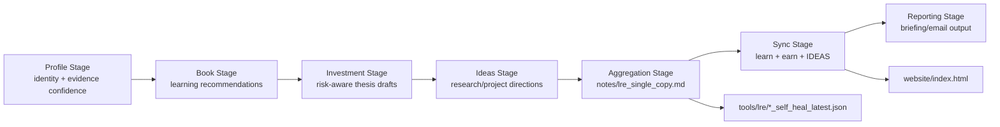
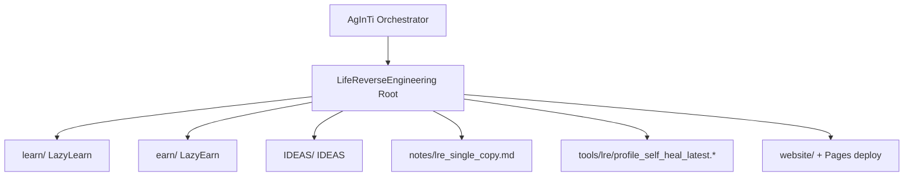

[English](README.md) · [العربية](i18n/README.ar.md) · [Español](i18n/README.es.md) · [Français](i18n/README.fr.md) · [日本語](i18n/README.ja.md) · [한국어](i18n/README.ko.md) · [Tiếng Việt](i18n/README.vi.md) · [中文 (简体)](i18n/README.zh-Hans.md) · [中文（繁體）](i18n/README.zh-Hant.md) · [Deutsch](i18n/README.de.md) · [Русский](i18n/README.ru.md)

Language options: **English (current draft)**. Root-level multilingual README files are managed one-by-one in `i18n/` (directory exists; files pending).

# LifeReverseEngineering

[](https://github.com/lachlanchen/LifeReverseEngineering)
[](https://lre.lazying.art/)
[](https://github.com/lachlanchen/LifeReverseEngineering/actions/workflows/static.yml)
[](#pipeline-logic)
[](#single-copy-output-policy)
[](#features)
[](#i18n)

LifeReverseEngineering (LRE) is a personal deep-research workspace that turns profile context into actionable outputs across three execution tracks:

- `learn` (LazyLearn): book plans and learning paths
- `earn` (LazyEarn): investment ideas and thesis tracking
- `IDEAS`: research directions and project concepts

The repository is designed for iterative runs with single-copy updates, so each cycle refreshes the latest artifacts instead of endlessly appending duplicates.

## Overview

LRE acts as a coordination and aggregation surface, while most domain implementation lives inside Git submodules:

- `learn/` for learning and computational physics/chemistry work
- `earn/` for investment briefs, PDF artifacts, and static site outputs
- `IDEAS/` for idea-to-publication workflows and generated docs catalogs

At root, LRE focuses on:

- pipeline framing and orchestration handoff
- single-copy report artifacts in `notes/`
- self-heal diagnostics in `tools/`
- a root landing page deployed from `website/` to `lre.lazying.art`

### Quick Scope Map

| Area | Primary Path | Responsibility |
|---|---|---|
| 🧭 Orchestration handoff | Root repo | Pipeline framing + coordination |
| 📄 Consolidated report | `notes/lre_single_copy.md` | Single latest markdown briefing |
| 🩺 Diagnostics | `tools/lre/` | Self-heal snapshots and logs |
| 🌐 Public landing page | `website/` | Root GitHub Pages deployment |
| 🧠 Domain execution | `learn/`, `earn/`, `IDEAS/` | Track-specific implementation |

## Status

LRE is active and optimized for:

- high-frequency iterative updates
- evidence-aware research summaries
- cross-repo output synchronization

### Current Operational Posture

| Signal | State |
|---|---|
| Root pipeline posture | ✅ Active |
| Root Pages deployment | ✅ Enabled (`website/`) |
| Root i18n README variants | 🟡 Directory present, files pending |
| Output model | ✅ Single-copy overwrite/update |

## Features

- Three-track coordination model (`learn`, `earn`, `IDEAS`) with clear responsibility boundaries.
- Single-copy output policy for cleaner auditing and lower operational noise.
- Root-level GitHub Pages deployment from `website/` only.
- Track-level self-heal logging snapshots for debugging and prompt/tool evolution.
- Submodule-based architecture so each track can evolve independently.
- Existing root `i18n/` directory reserved for multilingual README variants.

## Core Structure

```text
LifeReverseEngineering/
├── learn/            # LazyLearn submodule
├── earn/             # LazyEarn submodule
├── IDEAS/            # IDEAS submodule
├── notes/            # consolidated outputs (single-copy reports)
├── tools/            # self-heal logs and helper artifacts
└── website/          # static website for GitHub Pages
```

Expanded root map:

```text
LifeReverseEngineering/
├── README.md
├── .gitmodules
├── .github/
│   ├── FUNDING.yml
│   └── workflows/static.yml
├── website/
│   ├── index.html
│   ├── CNAME
│   └── logos/
├── notes/
│   └── lre_single_copy.md
├── tools/
│   └── lre/
│       ├── profile_self_heal_latest.json
│       └── profile_self_heal_latest.log
├── i18n/                 # exists, currently empty
├── learn/                # submodule
├── earn/                 # submodule
└── IDEAS/                # submodule
```

## Pipeline Logic

LRE runs as a staged pipeline (orchestrated by prompt tools in the parent AgInTi repo):

1. Profile stage: resolve identity anchors and evidence confidence.
2. Book stage: generate growth-focused reading recommendations.
3. Investment stage: draft opportunities, risk framing, and thesis notes.
4. Ideas stage: propose research/project directions with next actions.
5. Aggregation stage: build a single-copy markdown report.
6. Sync stage: write latest outputs into `learn`, `earn`, and `IDEAS`.
7. Reporting stage: produce final email/briefing content.



### Runtime Ownership View



## Single-Copy Output Policy

This repository follows overwrite/update behavior for key summary files:

- Keep one current version of major notes.
- Replace old "latest" snapshots with new run outputs.
- Keep self-heal diagnostics in dedicated tool/log paths.

This makes daily/periodic runs clean, auditable, and easy to inspect.

### Key Artifacts and Behavior

| Artifact | Behavior |
|---|---|
| `notes/lre_single_copy.md` | Overwritten/updated with latest consolidated report |
| `tools/lre/profile_self_heal_latest.json` | Replaced with latest root self-heal snapshot |
| `tools/lre/profile_self_heal_latest.log` | Updated latest diagnostic log |

## Prerequisites

- `git` 2.30+ (recommended) with submodule support.
- GitHub access to submodules listed in `.gitmodules`.
- SSH key configured for `git@github.com:lachlanchen/IDEAS.git` if using the current IDEAS submodule URL.
- Optional tools depending on track work:
  - Python 3.x + Jupyter stack (`learn/` workflows)
  - `pandoc` + `xelatex` (`earn/` PDF workflow)
  - Node.js 18 and `latexmk`/`xelatex` (`IDEAS/` site + publication workflows)

## Installation

Clone with submodules initialized:

```bash
git clone --recurse-submodules https://github.com/lachlanchen/LifeReverseEngineering.git
cd LifeReverseEngineering
```

If already cloned without submodules:

```bash
git submodule update --init --recursive
```

Keep submodules synced to their tracked refs:

```bash
git submodule sync --recursive
git submodule update --remote --recursive
```

## Usage

Typical root-level usage is report-centric rather than app-runtime-centric.

1. Inspect latest consolidated output:

```bash
sed -n '1,120p' notes/lre_single_copy.md
```

2. Inspect latest profile self-heal diagnostics:

```bash
sed -n '1,160p' tools/lre/profile_self_heal_latest.json
sed -n '1,80p' tools/lre/profile_self_heal_latest.log
```

3. Preview root website locally:

```bash
python3 -m http.server 8000 --directory website
# then open http://localhost:8000
```

4. Push `website/` updates to `main` to trigger root Pages deploy (`.github/workflows/static.yml`).

## Configuration

### Submodule wiring

Defined in `.gitmodules`:

- `learn` -> `https://github.com/lachlanchen/LazyLearn.git`
- `earn` -> `https://github.com/lachlanchen/LazyEarn.git`
- `IDEAS` -> `git@github.com:lachlanchen/IDEAS.git`

### Website and domain

- Static site source: `website/index.html`
- Custom domain target: `lre.lazying.art` (from `website/CNAME`)
- Root deploy workflow: `.github/workflows/static.yml`
- Deployment artifact scope: `website/` only

### i18n

- Root i18n directory exists: `i18n/`
- Current state: no root translation files yet
- Submodules (`learn`, `earn`, `IDEAS`) already maintain multilingual README variants in their own `i18n/` directories
- Language-options policy at root: maintain a single top line in each README variant and avoid duplicate language-option headers

### Output and diagnostics

- Consolidated report: `notes/lre_single_copy.md`
- Root self-heal snapshot: `tools/lre/profile_self_heal_latest.json`
- Related per-track snapshots:
  - `learn/tools/lre/books_self_heal_latest.json`
  - `earn/tools/lre/investments_self_heal_latest.json`
  - `IDEAS/tools/lre/ideas_self_heal_latest.json`

## Examples

### Example: verify run freshness

```bash
ls -lt notes/lre_single_copy.md tools/lre/profile_self_heal_latest.json
```

### Example: audit weak-signal diagnosis quickly

```bash
rg -n "weak|anchor|identity|non_empty" tools/lre/profile_self_heal_latest.json
```

### Example: update IDEA docs after changing `IDEAS/ideas/*.md`

```bash
cd IDEAS
npm install --no-save marked
node scripts/generate_site.mjs
```

### Example: regenerate and publish the root website

```bash
# edit website/index.html
git add website/index.html .github/workflows/static.yml
git commit -m "Update LRE website"
git push origin main
```

## Development Notes

- This repo is a coordination layer, not a single packaged application.
- No root `package.json`, `pyproject.toml`, or unified lockfile currently exists.
- Root CI is deployment-focused (Pages), not test/lint-focused.
- The staged orchestration scripts are referenced as living in the parent AgInTi repository, not in this repo.
- The website intentionally uses static assets and no build step at root.

## Troubleshooting

| Symptom | Check / Fix |
|---|---|
| Submodule is empty after clone | Run `git submodule update --init --recursive`. |
| IDEAS submodule authentication fails | Ensure GitHub SSH key access for `git@github.com:lachlanchen/IDEAS.git`, or switch submodule URL to HTTPS if needed. |
| Root Pages site did not update | Confirm changed files are under `website/**` or `.github/workflows/static.yml` and branch is `main`. |
| Website renders locally but not on custom domain | Verify `website/CNAME` contains `lre.lazying.art` and DNS is correctly pointed to GitHub Pages. |
| Self-heal report appears stale | Check file modification times in `tools/lre/` and track run IDs in `notes/lre_single_copy.md`. |
| Locale warnings (e.g., `LC_ALL=C.UTF-8`) appear in logs | This is typically environment-level and non-fatal for report generation. |

## Roadmap

- Add root multilingual README variants under `i18n/` and keep language options synchronized.
- Add root-level integrity checks (link verification + artifact freshness checks).
- Improve cross-track evidence quality dashboards based on self-heal snapshots.
- Clarify and automate parent-orchestrator handoff contracts from AgInTi -> LRE.
- Expand troubleshooting playbooks for repeated weak-signal scenarios.

## Related Repositories

- AgInTi: orchestration and prompt-tool system.
- LazyLearn (`learn/`): learning and reading outputs.
- LazyEarn (`earn/`): investment outputs.
- IDEAS (`IDEAS/`): research/idea outputs.

## Contribution

Contributions are welcome for:

- improving root pipeline documentation
- hardening diagnostics and artifact quality checks
- enhancing website clarity and operational transparency
- adding root i18n README variants in a consistent format

Recommended process:

1. Open an issue describing scope and affected track(s).
2. Keep changes scoped to the correct layer (`root` vs `learn`/`earn`/`IDEAS`).
3. Include before/after notes for any workflow or command changes.
4. If touching deployment behavior, include the exact path and trigger impact.

## Support

Funding and support links (from `.github/FUNDING.yml`):

- GitHub Sponsors: [https://github.com/sponsors/lachlanchen](https://github.com/sponsors/lachlanchen)
- Project network: [https://lazying.art](https://lazying.art)
- Community/chat: [https://chat.lazying.art](https://chat.lazying.art)
- Related initiative: [https://onlyideas.art](https://onlyideas.art)

## License

No root `LICENSE` file is present in this repository as of March 3, 2026.

Assumption: until a license is added, usage rights are not explicitly granted beyond standard GitHub visibility expectations. Add a `LICENSE` file to make reuse terms explicit.
