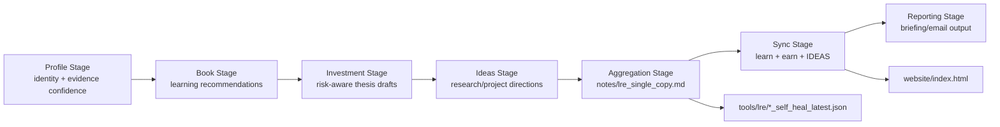
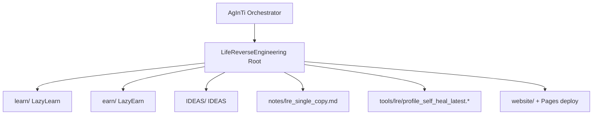

[English](../README.md) · [العربية](README.ar.md) · [Español](README.es.md) · [Français](README.fr.md) · [日本語](README.ja.md) · [한국어](README.ko.md) · [Tiếng Việt](README.vi.md) · [中文 (简体)](README.zh-Hans.md) · [中文（繁體）](README.zh-Hant.md) · [Deutsch](README.de.md) · [Русский](README.ru.md)


خيارات اللغة: **الإنجليزية (المسودة الحالية)**. تتم إدارة ملفات README متعددة اللغات على مستوى الجذر واحدًا تلو الآخر داخل `i18n/` (الدليل موجود؛ الملفات قيد الإضافة).

# LifeReverseEngineering

[](https://github.com/lachlanchen/LifeReverseEngineering)
[](https://lre.lazying.art/)
[](https://github.com/lachlanchen/LifeReverseEngineering/actions/workflows/static.yml)
[](#pipeline-logic)
[](#single-copy-output-policy)
[](#features)
[](#i18n)

LifeReverseEngineering (LRE) هي مساحة عمل شخصية للبحث العميق تُحوّل سياق الملف الشخصي إلى مخرجات قابلة للتنفيذ عبر ثلاثة مسارات تنفيذ:

- `learn` (LazyLearn): خطط كتب ومسارات تعلم
- `earn` (LazyEarn): أفكار استثمار وتتبع الفرضيات
- `IDEAS`: اتجاهات بحثية ومفاهيم مشاريع

صُمّم هذا المستودع للتشغيلات التكرارية مع تحديث بنسخة واحدة، بحيث تقوم كل دورة بتحديث أحدث المخرجات بدلًا من الإضافة المستمرة لنسخ مكررة.

## نظرة عامة

يعمل LRE كطبقة تنسيق وتجميع، بينما توجد معظم تطبيقات المجالات داخل وحدات Git الفرعية:

- `learn/` لأعمال التعلم والفيزياء/الكيمياء الحاسوبية
- `earn/` لملخصات الاستثمار، وملفات PDF، ومخرجات المواقع الثابتة
- `IDEAS/` لسير عمل تحويل الفكرة إلى منشور ولفهارس المستندات المُولّدة

على مستوى الجذر، يركّز LRE على:

- تأطير خط الأنابيب وتمرير مهام التنسيق
- تقارير نسخة واحدة في `notes/`
- تشخيصات الإصلاح الذاتي في `tools/`
- صفحة هبوط جذرية تُنشر من `website/` إلى `lre.lazying.art`

### خريطة النطاق السريعة

| Area | Primary Path | Responsibility |
|---|---|---|
| 🧭 تسليم التنسيق | Root repo | تأطير خط الأنابيب + التنسيق |
| 📄 التقرير الموحّد | `notes/lre_single_copy.md` | أحدث إحاطة Markdown بنسخة واحدة |
| 🩺 التشخيصات | `tools/lre/` | لقطات وسجلات الإصلاح الذاتي |
| 🌐 صفحة الهبوط العامة | `website/` | نشر GitHub Pages على مستوى الجذر |
| 🧠 التنفيذ حسب المجال | `learn/`, `earn/`, `IDEAS/` | تنفيذ خاص بكل مسار |

## الحالة

LRE نشط ومهيأ لـ:

- تحديثات تكرارية عالية الوتيرة
- ملخصات بحثية تراعي الأدلة
- مزامنة المخرجات عبر المستودعات

### الوضع التشغيلي الحالي

| Signal | State |
|---|---|
| وضع خط الأنابيب في الجذر | ✅ نشط |
| نشر Pages للجذر | ✅ مفعّل (`website/`) |
| متغيرات README متعددة اللغات في الجذر | 🟡 الدليل موجود، والملفات قيد الإضافة |
| نموذج المخرجات | ✅ تحديث/استبدال بنسخة واحدة |

## الميزات

- نموذج تنسيق بثلاثة مسارات (`learn`, `earn`, `IDEAS`) مع حدود مسؤولية واضحة.
- سياسة مخرجات بنسخة واحدة لتدقيق أنظف وضجيج تشغيلي أقل.
- نشر GitHub Pages على مستوى الجذر من `website/` فقط.
- لقطات سجلات الإصلاح الذاتي على مستوى المسارات للتصحيح وتطوير المطالبات/الأدوات.
- بنية قائمة على الوحدات الفرعية بحيث يمكن لكل مسار التطور بشكل مستقل.
- دليل `i18n/` موجود في الجذر ومخصص لنسخ README متعددة اللغات.

## البنية الأساسية

```text
LifeReverseEngineering/
├── learn/            # LazyLearn submodule
├── earn/             # LazyEarn submodule
├── IDEAS/            # IDEAS submodule
├── notes/            # consolidated outputs (single-copy reports)
├── tools/            # self-heal logs and helper artifacts
└── website/          # static website for GitHub Pages
```

خريطة الجذر الموسعة:

```text
LifeReverseEngineering/
├── README.md
├── .gitmodules
├── .github/
│   ├── FUNDING.yml
│   └── workflows/static.yml
├── website/
│   ├── index.html
│   ├── CNAME
│   └── logos/
├── notes/
│   └── lre_single_copy.md
├── tools/
│   └── lre/
│       ├── profile_self_heal_latest.json
│       └── profile_self_heal_latest.log
├── i18n/                 # exists, currently empty
├── learn/                # submodule
├── earn/                 # submodule
└── IDEAS/                # submodule
```

## منطق خط الأنابيب

يعمل LRE كخط أنابيب مرحلي (تتم إدارته عبر أدوات المطالبات في مستودع AgInTi الأب):

1. مرحلة الملف الشخصي: تحديد ركائز الهوية وموثوقية الأدلة.
2. مرحلة الكتب: توليد توصيات قراءة موجهة للنمو.
3. مرحلة الاستثمار: صياغة الفرص، وتأطير المخاطر، وملاحظات الفرضيات.
4. مرحلة الأفكار: اقتراح اتجاهات بحث/مشروع مع الخطوات التالية.
5. مرحلة التجميع: إنشاء تقرير Markdown بنسخة واحدة.
6. مرحلة المزامنة: كتابة أحدث المخرجات في `learn` و`earn` و`IDEAS`.
7. مرحلة التقارير: إنتاج محتوى الإحاطة/البريد النهائي.



### منظور ملكية وقت التشغيل



## سياسة المخرجات بنسخة واحدة

يتبع هذا المستودع سلوك الاستبدال/التحديث لملفات الملخصات الأساسية:

- الاحتفاظ بنسخة حالية واحدة من الملاحظات الرئيسية.
- استبدال لقطات "latest" القديمة بمخرجات التشغيل الجديدة.
- حفظ تشخيصات الإصلاح الذاتي في مسارات أدوات/سجلات مخصصة.

هذا يجعل التشغيلات اليومية/الدورية نظيفة وقابلة للتدقيق وسهلة الفحص.

### العناصر الأساسية وسلوكها

| Artifact | Behavior |
|---|---|
| `notes/lre_single_copy.md` | يُستبدل/يُحدّث بأحدث تقرير موحّد |
| `tools/lre/profile_self_heal_latest.json` | يُستبدل بأحدث لقطة إصلاح ذاتي على مستوى الجذر |
| `tools/lre/profile_self_heal_latest.log` | يُحدّث إلى أحدث سجل تشخيص |

## المتطلبات المسبقة

- `git` 2.30+ (موصى به) مع دعم الوحدات الفرعية.
- وصول GitHub إلى الوحدات الفرعية المذكورة في `.gitmodules`.
- مفتاح SSH مُعدّ لـ `git@github.com:lachlanchen/IDEAS.git` عند استخدام رابط وحدة IDEAS الفرعية الحالي.
- أدوات اختيارية حسب عمل المسار:
  - Python 3.x + حزمة Jupyter (`learn/` workflows)
  - `pandoc` + `xelatex` (`earn/` PDF workflow)
  - Node.js 18 و`latexmk`/`xelatex` (`IDEAS/` site + publication workflows)

## التثبيت

الاستنساخ مع تهيئة الوحدات الفرعية:

```bash
git clone --recurse-submodules https://github.com/lachlanchen/LifeReverseEngineering.git
cd LifeReverseEngineering
```

إذا كان الاستنساخ تم مسبقًا بدون وحدات فرعية:

```bash
git submodule update --init --recursive
```

حافظ على مزامنة الوحدات الفرعية مع المراجع المتتبعة:

```bash
git submodule sync --recursive
git submodule update --remote --recursive
```

## الاستخدام

الاستخدام المعتاد على مستوى الجذر يتمحور حول التقارير أكثر من كونه تشغيل تطبيق.

1. فحص أحدث مخرجات موحّدة:

```bash
sed -n '1,120p' notes/lre_single_copy.md
```

2. فحص أحدث تشخيصات الإصلاح الذاتي الخاصة بالملف الشخصي:

```bash
sed -n '1,160p' tools/lre/profile_self_heal_latest.json
sed -n '1,80p' tools/lre/profile_self_heal_latest.log
```

3. معاينة موقع الجذر محليًا:

```bash
python3 -m http.server 8000 --directory website
# then open http://localhost:8000
```

4. ادفع تحديثات `website/` إلى `main` لتشغيل نشر Pages للجذر (`.github/workflows/static.yml`).

## الإعداد

### ربط الوحدات الفرعية

مُعرّف في `.gitmodules`:

- `learn` -> `https://github.com/lachlanchen/LazyLearn.git`
- `earn` -> `https://github.com/lachlanchen/LazyEarn.git`
- `IDEAS` -> `git@github.com:lachlanchen/IDEAS.git`

### الموقع والنطاق

- مصدر الموقع الثابت: `website/index.html`
- النطاق المخصص المستهدف: `lre.lazying.art` (من `website/CNAME`)
- سير عمل النشر على مستوى الجذر: `.github/workflows/static.yml`
- نطاق عنصر النشر: `website/` فقط

### i18n

- دليل i18n على مستوى الجذر موجود: `i18n/`
- الحالة الحالية: لا توجد ملفات ترجمة جذرية بعد
- الوحدات الفرعية (`learn`, `earn`, `IDEAS`) لديها بالفعل متغيرات README متعددة اللغات داخل أدلة `i18n/` الخاصة بها
- سياسة سطر خيارات اللغة في الجذر: الحفاظ على سطر علوي واحد في كل نسخة README وتجنب ترويسات خيارات اللغة المكررة

### المخرجات والتشخيصات

- التقرير الموحّد: `notes/lre_single_copy.md`
- لقطة الإصلاح الذاتي على مستوى الجذر: `tools/lre/profile_self_heal_latest.json`
- لقطات مرتبطة لكل مسار:
  - `learn/tools/lre/books_self_heal_latest.json`
  - `earn/tools/lre/investments_self_heal_latest.json`
  - `IDEAS/tools/lre/ideas_self_heal_latest.json`

## أمثلة

### مثال: التحقق من حداثة التشغيل

```bash
ls -lt notes/lre_single_copy.md tools/lre/profile_self_heal_latest.json
```

### مثال: تدقيق تشخيص الإشارة الضعيفة بسرعة

```bash
rg -n "weak|anchor|identity|non_empty" tools/lre/profile_self_heal_latest.json
```

### مثال: تحديث وثائق IDEA بعد تعديل `IDEAS/ideas/*.md`

```bash
cd IDEAS
npm install --no-save marked
node scripts/generate_site.mjs
```

### مثال: إعادة توليد ونشر موقع الجذر

```bash
# edit website/index.html
git add website/index.html .github/workflows/static.yml
git commit -m "Update LRE website"
git push origin main
```

## ملاحظات التطوير

- هذا المستودع طبقة تنسيق، وليس تطبيقًا واحدًا مُحزّمًا.
- لا يوجد حاليًا `package.json` أو `pyproject.toml` أو ملف lock موحد على مستوى الجذر.
- التكامل المستمر في الجذر يركّز على النشر (Pages) وليس على الاختبارات/التدقيق.
- يُشار إلى سكربتات التنسيق المرحلية على أنها موجودة في مستودع AgInTi الأب، وليست في هذا المستودع.
- الموقع يستخدم عمدًا أصولًا ثابتة وبدون خطوة بناء على مستوى الجذر.

## استكشاف الأخطاء وإصلاحها

| Symptom | Check / Fix |
|---|---|
| الوحدة الفرعية فارغة بعد الاستنساخ | نفّذ `git submodule update --init --recursive`. |
| فشل مصادقة وحدة IDEAS الفرعية | تأكد من صلاحية مفتاح SSH على GitHub لـ `git@github.com:lachlanchen/IDEAS.git`، أو بدّل رابط الوحدة الفرعية إلى HTTPS عند الحاجة. |
| موقع Pages للجذر لم يتحدث | تأكد أن الملفات المعدّلة ضمن `website/**` أو `.github/workflows/static.yml` وأن الفرع هو `main`. |
| الموقع يعمل محليًا ولكن لا يعمل على النطاق المخصص | تحقق من أن `website/CNAME` يحتوي `lre.lazying.art` وأن DNS موجّه بشكل صحيح إلى GitHub Pages. |
| تقرير الإصلاح الذاتي يبدو قديمًا | افحص أوقات تعديل الملفات في `tools/lre/` ومعرفات التشغيل في `notes/lre_single_copy.md`. |
| تحذيرات Locale (مثل `LC_ALL=C.UTF-8`) تظهر في السجلات | غالبًا تكون على مستوى البيئة وليست قاتلة لتوليد التقارير. |

## خارطة الطريق

- إضافة متغيرات README متعددة اللغات على مستوى الجذر ضمن `i18n/` مع إبقاء خيارات اللغة متزامنة.
- إضافة فحوصات تكامل على مستوى الجذر (التحقق من الروابط + حداثة العناصر).
- تحسين لوحات جودة الأدلة عبر المسارات اعتمادًا على لقطات الإصلاح الذاتي.
- توضيح وأتمتة عقود التسليم من المنسّق الأب AgInTi إلى LRE.
- توسيع أدلة استكشاف الأخطاء للسيناريوهات المتكررة ذات الإشارات الضعيفة.

## مستودعات ذات صلة

- AgInTi: نظام التنسيق وأدوات المطالبات.
- LazyLearn (`learn/`): مخرجات التعلم والقراءة.
- LazyEarn (`earn/`): مخرجات الاستثمار.
- IDEAS (`IDEAS/`): مخرجات البحث/الأفكار.

## المساهمة

المساهمات مرحب بها في:

- تحسين توثيق خط الأنابيب على مستوى الجذر
- تقوية التشخيصات وفحوصات جودة العناصر
- تحسين وضوح الموقع والشفافية التشغيلية
- إضافة متغيرات README جذرية متعددة اللغات بصيغة متسقة

العملية الموصى بها:

1. افتح issue يصف النطاق والمسارات المتأثرة.
2. اجعل التغييرات ضمن الطبقة الصحيحة (`root` مقابل `learn`/`earn`/`IDEAS`).
3. أضف ملاحظات قبل/بعد لأي تغييرات في سير العمل أو الأوامر.
4. عند تعديل سلوك النشر، اذكر المسار الدقيق وتأثير المحفّز.

## الدعم

روابط الدعم والتمويل (من `.github/FUNDING.yml`):

- GitHub Sponsors: [https://github.com/sponsors/lachlanchen](https://github.com/sponsors/lachlanchen)
- شبكة المشروع: [https://lazying.art](https://lazying.art)
- المجتمع/الدردشة: [https://chat.lazying.art](https://chat.lazying.art)
- مبادرة ذات صلة: [https://onlyideas.art](https://onlyideas.art)

## الترخيص

لا يوجد ملف `LICENSE` على مستوى الجذر في هذا المستودع حتى تاريخ 3 مارس 2026.

افتراض: إلى أن تتم إضافة ترخيص، لا تُمنح حقوق الاستخدام صراحةً بما يتجاوز توقعات الظهور القياسية في GitHub. أضف ملف `LICENSE` لتوضيح شروط إعادة الاستخدام.
