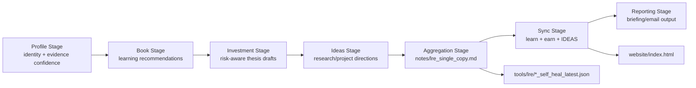
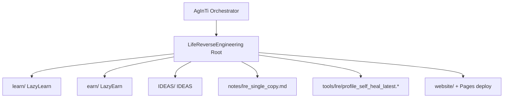

[English](../README.md) · [العربية](README.ar.md) · [Español](README.es.md) · [Français](README.fr.md) · [日本語](README.ja.md) · [한국어](README.ko.md) · [Tiếng Việt](README.vi.md) · [中文 (简体)](README.zh-Hans.md) · [中文（繁體）](README.zh-Hant.md) · [Deutsch](README.de.md) · [Русский](README.ru.md)

[](https://github.com/lachlanchen/lachlanchen/blob/main/figs/banner.png)

# LifeReverseEngineering

[](https://github.com/lachlanchen/LifeReverseEngineering)
[](https://lre.lazying.art/)
[](https://github.com/lachlanchen/LifeReverseEngineering/actions/workflows/static.yml)
[](#pipeline-logic)
[](#single-copy-output-policy)
[](#features)
[](#i18n)

LifeReverseEngineering (LRE) ist ein persoenlicher Deep-Research-Arbeitsbereich, der Profilkontext in umsetzbare Ergebnisse ueber drei Ausfuehrungsspuren umwandelt:

- `learn` (LazyLearn): Buecherplaene und Lernpfade
- `earn` (LazyEarn): Investitionsideen und Thesis-Tracking
- `IDEAS`: Forschungsrichtungen und Projektkonzepte

Das Repository ist fuer iterative Durchlaeufe mit Single-Copy-Updates ausgelegt, sodass jeder Zyklus die neuesten Artefakte aktualisiert, statt endlos Duplikate anzuhaengen.

## Ueberblick

LRE fungiert als Koordinations- und Aggregationsflaeche, waehrend der groesste Teil der fachlichen Implementierung in Git-Submodulen liegt:

- `learn/` fuer Lernen und Arbeiten in computergestuetzter Physik/Chemie
- `earn/` fuer Investment-Briefings, PDF-Artefakte und statische Site-Ausgaben
- `IDEAS/` fuer Workflows von der Idee zur Veroeffentlichung und generierte Doku-Kataloge

Im Root-Verzeichnis konzentriert sich LRE auf:

- Pipeline-Rahmung und Orchestrierungs-Handoff
- Single-Copy-Reportartefakte in `notes/`
- Self-Heal-Diagnostik in `tools/`
- eine Root-Landingpage, bereitgestellt aus `website/` nach `lre.lazying.art`

### Schnelle Bereichsuebersicht

| Bereich                     | Primaerer Pfad              | Verantwortung                           |
| --------------------------- | --------------------------- | --------------------------------------- |
| 🧭 Orchestrierungs-Handoff  | Root-Repo                   | Pipeline-Rahmung + Koordination         |
| 📄 Konsolidierter Bericht   | `notes/lre_single_copy.md`  | Einziger aktueller Markdown-Kurzbericht |
| 🩺 Diagnostik               | `tools/lre/`                | Self-Heal-Snapshots und Logs            |
| 🌐 Oeffentliche Landingpage | `website/`                  | Root-GitHub-Pages-Deployment            |
| 🧠 Fachliche Ausfuehrung    | `learn/`, `earn/`, `IDEAS/` | Spur-spezifische Implementierung        |

## Status

LRE ist aktiv und optimiert fuer:

- hochfrequente iterative Updates
- evidenzbewusste Forschungszusammenfassungen
- repo-uebergreifende Ausgabesynchronisierung

### Aktuelle operative Lage

| Signal                     | Status                                       |
| -------------------------- | -------------------------------------------- |
| Root-Pipeline-Lage         | ✅ Aktiv                                     |
| Root-Pages-Deployment      | ✅ Aktiviert (`website/`)                    |
| Root-i18n-README-Varianten | 🟡 Verzeichnis vorhanden, Dateien ausstehend |
| Ausgabemodell              | ✅ Single-Copy Ueberschreiben/Aktualisieren  |

<a id="features"></a>

## Funktionen

- Drei-Spuren-Koordinationsmodell (`learn`, `earn`, `IDEAS`) mit klaren Verantwortungsgrenzen.
- Single-Copy-Ausgabepolitik fuer sauberere Audits und weniger operatives Rauschen.
- Root-GitHub-Pages-Deployment ausschliesslich aus `website/`.
- Spurbezogene Self-Heal-Log-Snapshots fuer Debugging und Prompt/Tool-Weiterentwicklung.
- Submodul-basierte Architektur, damit sich jede Spur unabhaengig weiterentwickeln kann.
- Vorhandenes Root-Verzeichnis `i18n/`, reserviert fuer mehrsprachige README-Varianten.

## Kernstruktur

```text
LifeReverseEngineering/
├── learn/            # LazyLearn submodule
├── earn/             # LazyEarn submodule
├── IDEAS/            # IDEAS submodule
├── notes/            # consolidated outputs (single-copy reports)
├── tools/            # self-heal logs and helper artifacts
└── website/          # static website for GitHub Pages
```

Erweiterte Root-Uebersicht:

```text
LifeReverseEngineering/
├── README.md
├── .gitmodules
├── .github/
│   ├── FUNDING.yml
│   └── workflows/static.yml
├── website/
│   ├── index.html
│   ├── CNAME
│   └── logos/
├── notes/
│   └── lre_single_copy.md
├── tools/
│   └── lre/
│       ├── profile_self_heal_latest.json
│       └── profile_self_heal_latest.log
├── i18n/                 # exists, currently empty
├── learn/                # submodule
├── earn/                 # submodule
└── IDEAS/                # submodule
```

<a id="pipeline-logic"></a>

## Pipeline-Logik

LRE laeuft als gestufte Pipeline (orchestriert durch Prompt-Tools im uebergeordneten AgInTi-Repo):

1. Profilstufe: Identitaetsanker und Evidenzsicherheit aufloesen.
2. Buchstufe: wachstumsorientierte Leseempfehlungen erzeugen.
3. Investmentstufe: Chancen, Risikorahmen und Thesis-Notizen entwerfen.
4. Ideenstufe: Forschungs-/Projekt-Richtungen mit naechsten Schritten vorschlagen.
5. Aggregationsstufe: einen Single-Copy-Markdown-Bericht erstellen.
6. Sync-Stufe: neueste Ausgaben in `learn`, `earn` und `IDEAS` schreiben.
7. Reporting-Stufe: finalen E-Mail-/Briefing-Inhalt erzeugen.



### Laufzeit-Verantwortungsansicht



<a id="single-copy-output-policy"></a>

## Single-Copy-Ausgaberichtlinie

Dieses Repository folgt einem Ueberschreiben/Aktualisieren-Verhalten fuer zentrale Zusammenfassungsdateien:

- Eine aktuelle Version der wichtigsten Notizen beibehalten.
- Alte "latest"-Snapshots durch neue Lauf-Ausgaben ersetzen.
- Self-Heal-Diagnostik in dedizierten Tool/Log-Pfaden halten.

So bleiben taegliche/periodische Durchlaeufe sauber, auditierbar und leicht pruefbar.

### Zentrale Artefakte und Verhalten

| Artefakt                                  | Verhalten                                                           |
| ----------------------------------------- | ------------------------------------------------------------------- |
| `notes/lre_single_copy.md`                | Mit dem neuesten konsolidierten Bericht ueberschrieben/aktualisiert |
| `tools/lre/profile_self_heal_latest.json` | Durch den neuesten Root-Self-Heal-Snapshot ersetzt                  |
| `tools/lre/profile_self_heal_latest.log`  | Neuestes Diagnostik-Log aktualisiert                                |

## Voraussetzungen

- `git` 2.30+ (empfohlen) mit Submodul-Unterstuetzung.
- GitHub-Zugriff auf die in `.gitmodules` gelisteten Submodule.
- SSH-Schluessel fuer `git@github.com:lachlanchen/IDEAS.git`, falls die aktuelle IDEAS-Submodul-URL genutzt wird.
- Optionale Tools je nach Spur:
  - Python 3.x + Jupyter-Stack (`learn/`-Workflows)
  - `pandoc` + `xelatex` (`earn/`-PDF-Workflow)
  - Node.js 18 und `latexmk`/`xelatex` (`IDEAS/`-Site- und Publikations-Workflows)

## Installation

Mit initialisierten Submodulen klonen:

```bash
git clone --recurse-submodules https://github.com/lachlanchen/LifeReverseEngineering.git
cd LifeReverseEngineering
```

Falls bereits ohne Submodule geklont wurde:

```bash
git submodule update --init --recursive
```

Submodule auf ihre getrackten Refs synchron halten:

```bash
git submodule sync --recursive
git submodule update --remote --recursive
```

## Verwendung

Die typische Nutzung auf Root-Ebene ist berichtszentriert statt app-runtime-zentriert.

1. Neueste konsolidierte Ausgabe pruefen:

```bash
sed -n '1,120p' notes/lre_single_copy.md
```

2. Neueste Profil-Self-Heal-Diagnostik pruefen:

```bash
sed -n '1,160p' tools/lre/profile_self_heal_latest.json
sed -n '1,80p' tools/lre/profile_self_heal_latest.log
```

3. Root-Website lokal vorschauen:

```bash
python3 -m http.server 8000 --directory website
# then open http://localhost:8000
```

4. `website/`-Updates nach `main` pushen, um das Root-Pages-Deployment auszulösen (`.github/workflows/static.yml`).

## Konfiguration

### Submodule-Verdrahtung

Definiert in `.gitmodules`:

- `learn` -> `https://github.com/lachlanchen/LazyLearn.git`
- `earn` -> `https://github.com/lachlanchen/LazyEarn.git`
- `IDEAS` -> `git@github.com:lachlanchen/IDEAS.git`

### Website und Domain

- Statische Site-Quelle: `website/index.html`
- Ziel der Custom Domain: `lre.lazying.art` (aus `website/CNAME`)
- Root-Deployment-Workflow: `.github/workflows/static.yml`
- Geltungsbereich des Deployment-Artefakts: nur `website/`

### i18n

- Root-i18n-Verzeichnis vorhanden: `i18n/`
- Aktueller Stand: noch keine Root-Uebersetzungsdateien
- Submodule (`learn`, `earn`, `IDEAS`) pflegen bereits mehrsprachige README-Varianten in ihren eigenen `i18n/`-Verzeichnissen
- Sprachoptionen-Richtlinie im Root: in jeder README-Variante genau eine Top-Zeile pflegen und doppelte Sprachoptionen-Header vermeiden

### Ausgabe und Diagnostik

- Konsolidierter Bericht: `notes/lre_single_copy.md`
- Root-Self-Heal-Snapshot: `tools/lre/profile_self_heal_latest.json`
- Zugehoerige Snapshots pro Spur:
  - `learn/tools/lre/books_self_heal_latest.json`
  - `earn/tools/lre/investments_self_heal_latest.json`
  - `IDEAS/tools/lre/ideas_self_heal_latest.json`

## Beispiele

### Beispiel: Lauf-Aktualitaet pruefen

```bash
ls -lt notes/lre_single_copy.md tools/lre/profile_self_heal_latest.json
```

### Beispiel: Weak-Signal-Diagnose schnell auditieren

```bash
rg -n "weak|anchor|identity|non_empty" tools/lre/profile_self_heal_latest.json
```

### Beispiel: IDEAS-Dokumentation nach Aenderungen an `IDEAS/ideas/*.md` aktualisieren

```bash
cd IDEAS
npm install --no-save marked
node scripts/generate_site.mjs
```

### Beispiel: Root-Website neu erzeugen und veroeffentlichen

```bash
# edit website/index.html
git add website/index.html .github/workflows/static.yml
git commit -m "Update LRE website"
git push origin main
```

## Entwicklungshinweise

- Dieses Repo ist eine Koordinationsschicht, keine einzelne paketierte Anwendung.
- Aktuell existieren im Root weder `package.json` noch `pyproject.toml` noch ein vereinheitlichtes Lockfile.
- Root-CI ist deployment-fokussiert (Pages), nicht test/lint-fokussiert.
- Die gestuften Orchestrierungsskripte sind als im uebergeordneten AgInTi-Repository liegend referenziert, nicht in diesem Repo.
- Die Website nutzt absichtlich statische Assets und keinen Build-Schritt im Root.

## Fehlerbehebung

| Symptom                                                      | Pruefen / Beheben                                                                                                                                             |
| ------------------------------------------------------------ | ------------------------------------------------------------------------------------------------------------------------------------------------------------- |
| Submodule ist nach dem Klonen leer                           | `git submodule update --init --recursive` ausfuehren.                                                                                                         |
| IDEAS-Submodul-Authentifizierung schlaegt fehl               | Sicherstellen, dass GitHub-SSH-Schluesselzugriff fuer `git@github.com:lachlanchen/IDEAS.git` vorhanden ist, oder Submodul-URL bei Bedarf auf HTTPS umstellen. |
| Root-Pages-Site wurde nicht aktualisiert                     | Pruefen, dass geaenderte Dateien unter `website/**` oder `.github/workflows/static.yml` liegen und der Branch `main` ist.                                     |
| Website rendert lokal, aber nicht auf der Custom Domain      | Sicherstellen, dass `website/CNAME` `lre.lazying.art` enthaelt und DNS korrekt auf GitHub Pages zeigt.                                                        |
| Self-Heal-Bericht wirkt veraltet                             | Dateiaenderungszeiten in `tools/lre/` pruefen und Lauf-IDs in `notes/lre_single_copy.md` nachverfolgen.                                                       |
| Locale-Warnungen (z. B. `LC_ALL=C.UTF-8`) erscheinen in Logs | Das ist typischerweise umgebungsbedingt und fuer die Berichterzeugung nicht fatal.                                                                            |

## Roadmap

- Mehrsprachige Root-README-Varianten unter `i18n/` hinzufuegen und Sprachoptionen synchron halten.
- Integritaetspruefungen auf Root-Ebene ergaenzen (Linkverifikation + Artefakt-Freshness-Checks).
- Repo-uebergreifende Evidenzqualitaets-Dashboards auf Basis von Self-Heal-Snapshots verbessern.
- Handoff-Vertraege vom Parent-Orchestrator von AgInTi -> LRE klarstellen und automatisieren.
- Fehlerbehebungs-Playbooks fuer wiederkehrende Weak-Signal-Szenarien erweitern.

## Zugehoerige Repositories

- AgInTi: Orchestrierungs- und Prompt-Tool-System.
- LazyLearn (`learn/`): Lern- und Leseausgaben.
- LazyEarn (`earn/`): Investment-Ausgaben.
- IDEAS (`IDEAS/`): Forschungs-/Ideenausgaben.

## Mitwirken

Beitraege sind willkommen fuer:

- Verbesserung der Root-Pipeline-Dokumentation
- Haertung von Diagnostik und Artefakt-Qualitaetspruefungen
- mehr Klarheit der Website und operative Transparenz
- konsistentes Hinzufuegen von Root-i18n-README-Varianten

Empfohlener Ablauf:

1. Ein Issue mit Umfang und betroffenen Spur(en) erstellen.
2. Aenderungen auf die korrekte Ebene begrenzen (`root` vs `learn`/`earn`/`IDEAS`).
3. Vorher/Nachher-Notizen fuer alle Workflow- oder Kommandoaenderungen beilegen.
4. Bei Eingriffen ins Deployment-Verhalten den exakten Pfad und Trigger-Impact angeben.

## Unterstuetzung

Funding- und Support-Links (aus `.github/FUNDING.yml`):

- GitHub Sponsors: [https://github.com/sponsors/lachlanchen](https://github.com/sponsors/lachlanchen)
- Projektnetzwerk: [https://lazying.art](https://lazying.art)
- Community/Chat: [https://chat.lazying.art](https://chat.lazying.art)
- Zugehoerige Initiative: [https://onlyideas.art](https://onlyideas.art)

## Lizenz

In diesem Repository ist mit Stand 3. Maerz 2026 keine Root-`LICENSE`-Datei vorhanden.

Annahme: Bis eine Lizenz hinzugefuegt wird, werden Nutzungsrechte ueber die uebliche GitHub-Sichtbarkeit hinaus nicht explizit eingeraeumt. Fuege eine `LICENSE`-Datei hinzu, um Wiederverwendungsbedingungen eindeutig zu machen.
