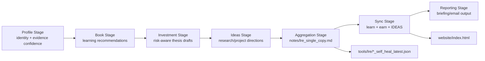
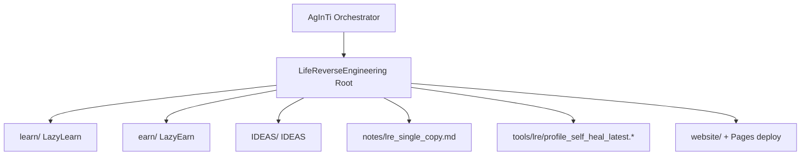

[English](../README.md) · [العربية](README.ar.md) · [Español](README.es.md) · [Français](README.fr.md) · [日本語](README.ja.md) · [한국어](README.ko.md) · [Tiếng Việt](README.vi.md) · [中文 (简体)](README.zh-Hans.md) · [中文（繁體）](README.zh-Hant.md) · [Deutsch](README.de.md) · [Русский](README.ru.md)

[](https://github.com/lachlanchen/lachlanchen/blob/main/figs/banner.png)

# LifeReverseEngineering

[](https://github.com/lachlanchen/LifeReverseEngineering)
[](https://lre.lazying.art/)
[](https://github.com/lachlanchen/LifeReverseEngineering/actions/workflows/static.yml)
[](#pipeline-logic)
[](#single-copy-output-policy)
[](#features)
[](#i18n)

LifeReverseEngineering (LRE) es un espacio personal de investigación profunda que transforma el contexto de perfil en resultados accionables a través de tres líneas de ejecución:

- `learn` (LazyLearn): planes de lectura y rutas de aprendizaje
- `earn` (LazyEarn): ideas de inversión y seguimiento de tesis
- `IDEAS`: direcciones de investigación y conceptos de proyecto

El repositorio está diseñado para ejecuciones iterativas con actualizaciones de copia única, de modo que cada ciclo refresca los artefactos más recientes en lugar de acumular duplicados indefinidamente.

## Visión general

LRE funciona como una capa de coordinación y agregación, mientras que la mayor parte de la implementación por dominio vive dentro de submódulos Git:

- `learn/` para aprendizaje y trabajo de física/química computacional
- `earn/` para informes de inversión, artefactos PDF y salidas de sitio estático
- `IDEAS/` para flujos de idea-a-publicación y catálogos de documentación generada

En la raíz, LRE se enfoca en:

- definición del pipeline y traspaso de orquestación
- artefactos de reporte de copia única en `notes/`
- diagnósticos de autorreparación en `tools/`
- una página de entrada raíz desplegada desde `website/` hacia `lre.lazying.art`

### Mapa rápido de alcance

| Área                         | Ruta principal              | Responsabilidad                        |
| ---------------------------- | --------------------------- | -------------------------------------- |
| 🧭 Traspaso de orquestación  | Repositorio raíz            | Definición del pipeline + coordinación |
| 📄 Reporte consolidado       | `notes/lre_single_copy.md`  | Informe markdown único más reciente    |
| 🩺 Diagnósticos              | `tools/lre/`                | Snapshots y logs de autorreparación    |
| 🌐 Página pública de entrada | `website/`                  | Despliegue raíz en GitHub Pages        |
| 🧠 Ejecución por dominio     | `learn/`, `earn/`, `IDEAS/` | Implementación específica por línea    |

## Estado

LRE está activo y optimizado para:

- actualizaciones iterativas de alta frecuencia
- resúmenes de investigación conscientes de la evidencia
- sincronización de resultados entre repositorios

### Postura operativa actual

| Señal                          | Estado                                        |
| ------------------------------ | --------------------------------------------- |
| Postura del pipeline raíz      | ✅ Activo                                     |
| Despliegue de Pages en raíz    | ✅ Habilitado (`website/`)                    |
| Variantes i18n del README raíz | 🟡 Directorio presente, archivos pendientes   |
| Modelo de salida               | ✅ Sobrescritura/actualización de copia única |

<a id="features"></a>

## Funcionalidades

- Modelo de coordinación de tres líneas (`learn`, `earn`, `IDEAS`) con límites de responsabilidad claros.
- Política de salida de copia única para auditorías más limpias y menor ruido operativo.
- Despliegue de GitHub Pages a nivel raíz solo desde `website/`.
- Snapshots de logs de autorreparación por línea para depuración y evolución de prompts/herramientas.
- Arquitectura basada en submódulos para que cada línea evolucione de forma independiente.
- Directorio raíz `i18n/` existente y reservado para variantes multilingües del README.

## Estructura principal

```text
LifeReverseEngineering/
├── learn/            # LazyLearn submodule
├── earn/             # LazyEarn submodule
├── IDEAS/            # IDEAS submodule
├── notes/            # consolidated outputs (single-copy reports)
├── tools/            # self-heal logs and helper artifacts
└── website/          # static website for GitHub Pages
```

Mapa raíz ampliado:

```text
LifeReverseEngineering/
├── README.md
├── .gitmodules
├── .github/
│   ├── FUNDING.yml
│   └── workflows/static.yml
├── website/
│   ├── index.html
│   ├── CNAME
│   └── logos/
├── notes/
│   └── lre_single_copy.md
├── tools/
│   └── lre/
│       ├── profile_self_heal_latest.json
│       └── profile_self_heal_latest.log
├── i18n/                 # exists, currently empty
├── learn/                # submodule
├── earn/                 # submodule
└── IDEAS/                # submodule
```

<a id="pipeline-logic"></a>

## Lógica del pipeline

LRE se ejecuta como un pipeline por etapas (orquestado por herramientas de prompts en el repositorio padre AgInTi):

1. Etapa de perfil: resolver anclas de identidad y confianza de la evidencia.
2. Etapa de libros: generar recomendaciones de lectura orientadas al crecimiento.
3. Etapa de inversión: redactar oportunidades, marco de riesgo y notas de tesis.
4. Etapa de ideas: proponer direcciones de investigación/proyecto con acciones siguientes.
5. Etapa de agregación: construir un reporte markdown de copia única.
6. Etapa de sincronización: escribir las salidas más recientes en `learn`, `earn` y `IDEAS`.
7. Etapa de reporte: producir contenido final de correo/informe.



### Vista de propiedad en tiempo de ejecución



<a id="single-copy-output-policy"></a>

## Política de salida de copia única

Este repositorio sigue un comportamiento de sobrescritura/actualización para archivos de resumen clave:

- Mantener una versión actual de las notas principales.
- Reemplazar snapshots "latest" antiguos con nuevas salidas de ejecución.
- Mantener diagnósticos de autorreparación en rutas dedicadas de herramientas/logs.

Esto hace que las ejecuciones diarias/periódicas sean limpias, auditables y fáciles de inspeccionar.

### Artefactos clave y comportamiento

| Artefacto                                 | Comportamiento                                                   |
| ----------------------------------------- | ---------------------------------------------------------------- |
| `notes/lre_single_copy.md`                | Sobrescrito/actualizado con el reporte consolidado más reciente  |
| `tools/lre/profile_self_heal_latest.json` | Reemplazado con el snapshot de autorreparación raíz más reciente |
| `tools/lre/profile_self_heal_latest.log`  | Log de diagnóstico "latest" actualizado                          |

## Requisitos previos

- `git` 2.30+ (recomendado) con soporte de submódulos.
- Acceso de GitHub a los submódulos listados en `.gitmodules`.
- Clave SSH configurada para `git@github.com:lachlanchen/IDEAS.git` si se usa la URL actual del submódulo IDEAS.
- Herramientas opcionales según el trabajo por línea:
  - Python 3.x + stack de Jupyter (flujos de `learn/`)
  - `pandoc` + `xelatex` (flujo PDF de `earn/`)
  - Node.js 18 y `latexmk`/`xelatex` (sitio + flujos de publicación de `IDEAS/`)

## Instalación

Clonar con submódulos inicializados:

```bash
git clone --recurse-submodules https://github.com/lachlanchen/LifeReverseEngineering.git
cd LifeReverseEngineering
```

Si ya fue clonado sin submódulos:

```bash
git submodule update --init --recursive
```

Mantener los submódulos sincronizados con sus referencias seguidas:

```bash
git submodule sync --recursive
git submodule update --remote --recursive
```

## Uso

El uso típico a nivel raíz está centrado en reportes, más que en el runtime de una aplicación.

1. Inspeccionar la salida consolidada más reciente:

```bash
sed -n '1,120p' notes/lre_single_copy.md
```

2. Inspeccionar los diagnósticos de autorreparación de perfil más recientes:

```bash
sed -n '1,160p' tools/lre/profile_self_heal_latest.json
sed -n '1,80p' tools/lre/profile_self_heal_latest.log
```

3. Previsualizar el sitio raíz localmente:

```bash
python3 -m http.server 8000 --directory website
# then open http://localhost:8000
```

4. Publicar actualizaciones de `website/` a `main` para activar el despliegue raíz de Pages (`.github/workflows/static.yml`).

## Configuración

### Conexión de submódulos

Definida en `.gitmodules`:

- `learn` -> `https://github.com/lachlanchen/LazyLearn.git`
- `earn` -> `https://github.com/lachlanchen/LazyEarn.git`
- `IDEAS` -> `git@github.com:lachlanchen/IDEAS.git`

### Sitio web y dominio

- Fuente del sitio estático: `website/index.html`
- Dominio personalizado de destino: `lre.lazying.art` (desde `website/CNAME`)
- Flujo de despliegue raíz: `.github/workflows/static.yml`
- Alcance del artefacto de despliegue: solo `website/`

### i18n

- Existe el directorio i18n raíz: `i18n/`
- Estado actual: aún no hay archivos de traducción en raíz
- Los submódulos (`learn`, `earn`, `IDEAS`) ya mantienen variantes multilingües de README en sus propios directorios `i18n/`
- Política de opciones de idioma en raíz: mantener una sola línea superior en cada variante README y evitar cabeceras duplicadas de opciones de idioma

### Salida y diagnósticos

- Reporte consolidado: `notes/lre_single_copy.md`
- Snapshot de autorreparación raíz: `tools/lre/profile_self_heal_latest.json`
- Snapshots relacionados por línea:
  - `learn/tools/lre/books_self_heal_latest.json`
  - `earn/tools/lre/investments_self_heal_latest.json`
  - `IDEAS/tools/lre/ideas_self_heal_latest.json`

## Ejemplos

### Ejemplo: verificar frescura de ejecución

```bash
ls -lt notes/lre_single_copy.md tools/lre/profile_self_heal_latest.json
```

### Ejemplo: auditar rápidamente diagnósticos de señales débiles

```bash
rg -n "weak|anchor|identity|non_empty" tools/lre/profile_self_heal_latest.json
```

### Ejemplo: actualizar docs de IDEAS tras cambiar `IDEAS/ideas/*.md`

```bash
cd IDEAS
npm install --no-save marked
node scripts/generate_site.mjs
```

### Ejemplo: regenerar y publicar el sitio web raíz

```bash
# edit website/index.html
git add website/index.html .github/workflows/static.yml
git commit -m "Update LRE website"
git push origin main
```

## Notas de desarrollo

- Este repositorio es una capa de coordinación, no una aplicación empaquetada única.
- Actualmente no existe en raíz `package.json`, `pyproject.toml` ni un lockfile unificado.
- El CI de raíz está enfocado en despliegue (Pages), no en test/lint.
- Los scripts de orquestación por etapas se referencian como parte del repositorio padre AgInTi, no de este repositorio.
- El sitio web usa de forma intencional activos estáticos y no tiene paso de build en raíz.

## Resolución de problemas

| Síntoma                                                                | Comprobación / Solución                                                                                                                  |
| ---------------------------------------------------------------------- | ---------------------------------------------------------------------------------------------------------------------------------------- |
| El submódulo está vacío después de clonar                              | Ejecuta `git submodule update --init --recursive`.                                                                                       |
| Falla la autenticación del submódulo IDEAS                             | Asegura acceso con clave SSH de GitHub para `git@github.com:lachlanchen/IDEAS.git`, o cambia la URL del submódulo a HTTPS si hace falta. |
| El sitio de Pages raíz no se actualizó                                 | Confirma que los archivos cambiados están en `website/**` o `.github/workflows/static.yml` y que la rama es `main`.                      |
| El sitio renderiza localmente pero no en el dominio personalizado      | Verifica que `website/CNAME` contenga `lre.lazying.art` y que el DNS apunte correctamente a GitHub Pages.                                |
| El reporte de autorreparación parece desactualizado                    | Revisa fechas de modificación en `tools/lre/` y los IDs de ejecución en `notes/lre_single_copy.md`.                                      |
| Aparecen advertencias de locale (p. ej., `LC_ALL=C.UTF-8`) en los logs | Normalmente es del entorno y no es fatal para la generación de reportes.                                                                 |

## Hoja de ruta

- Añadir variantes multilingües del README raíz en `i18n/` y mantener sincronizadas las opciones de idioma.
- Añadir comprobaciones de integridad a nivel raíz (verificación de enlaces + frescura de artefactos).
- Mejorar paneles de calidad de evidencia entre líneas usando snapshots de autorreparación.
- Clarificar y automatizar contratos de handoff del orquestador padre de AgInTi -> LRE.
- Ampliar playbooks de resolución de problemas para escenarios repetidos de señal débil.

## Repositorios relacionados

- AgInTi: sistema de orquestación y prompt-tool.
- LazyLearn (`learn/`): resultados de aprendizaje y lectura.
- LazyEarn (`earn/`): resultados de inversión.
- IDEAS (`IDEAS/`): resultados de investigación/ideas.

## Contribución

Se agradecen contribuciones para:

- mejorar la documentación del pipeline raíz
- robustecer diagnósticos y comprobaciones de calidad de artefactos
- mejorar la claridad del sitio web y la transparencia operativa
- añadir variantes i18n del README raíz con un formato consistente

Proceso recomendado:

1. Abre un issue describiendo el alcance y las líneas afectadas.
2. Mantén los cambios acotados a la capa correcta (`root` vs `learn`/`earn`/`IDEAS`).
3. Incluye notas de antes/después para cualquier cambio de flujo de trabajo o comando.
4. Si tocas comportamiento de despliegue, incluye la ruta exacta y el impacto en disparadores.

## Soporte

Enlaces de financiación y soporte (desde `.github/FUNDING.yml`):

- GitHub Sponsors: [https://github.com/sponsors/lachlanchen](https://github.com/sponsors/lachlanchen)
- Red de proyectos: [https://lazying.art](https://lazying.art)
- Comunidad/chat: [https://chat.lazying.art](https://chat.lazying.art)
- Iniciativa relacionada: [https://onlyideas.art](https://onlyideas.art)

## Licencia

No existe un archivo `LICENSE` en la raíz de este repositorio al 3 de marzo de 2026.

Suposición: hasta que se añada una licencia, los derechos de uso no se otorgan explícitamente más allá de las expectativas estándar de visibilidad de GitHub. Añade un archivo `LICENSE` para explicitar los términos de reutilización.
