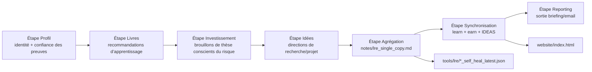
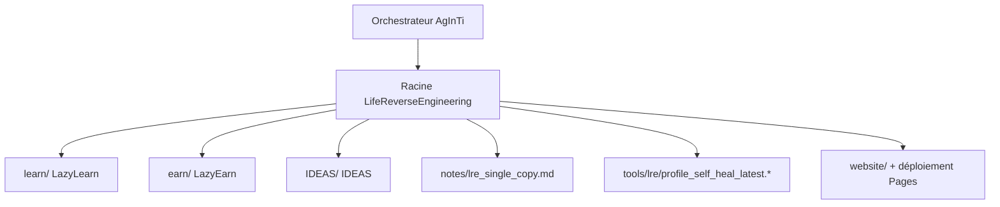

[English](../README.md) · [العربية](README.ar.md) · [Español](README.es.md) · [Français](README.fr.md) · [日本語](README.ja.md) · [한국어](README.ko.md) · [Tiếng Việt](README.vi.md) · [中文 (简体)](README.zh-Hans.md) · [中文（繁體）](README.zh-Hant.md) · [Deutsch](README.de.md) · [Русский](README.ru.md)


# LifeReverseEngineering

[](https://github.com/lachlanchen/LifeReverseEngineering)
[](https://lre.lazying.art/)
[](https://github.com/lachlanchen/LifeReverseEngineering/actions/workflows/static.yml)
[](#logique-du-pipeline)
[](#politique-de-sortie-single-copy)
[](#fonctionnalites)
[](#i18n)

LifeReverseEngineering (LRE) est un espace personnel de recherche approfondie qui transforme le contexte de profil en livrables actionnables sur trois axes d’exécution :

- `learn` (LazyLearn) : plans de lecture et parcours d’apprentissage
- `earn` (LazyEarn) : idées d’investissement et suivi des thèses
- `IDEAS` : orientations de recherche et concepts de projet

Le dépôt est conçu pour des exécutions itératives avec des mises à jour en copie unique : chaque cycle rafraîchit donc les derniers artefacts au lieu d’accumuler indéfiniment des doublons.

## Vue d’ensemble

LRE agit comme surface de coordination et d’agrégation, tandis que la majeure partie de l’implémentation métier vit dans des sous-modules Git :

- `learn/` pour l’apprentissage et les travaux en physique/chimie computationnelles
- `earn/` pour les notes d’investissement, artefacts PDF et sorties de site statique
- `IDEAS/` pour les workflows de l’idée à la publication et les catalogues de documentation générés

À la racine, LRE se concentre sur :

- cadrage du pipeline et orchestration de la transmission
- artefacts de rapport en copie unique dans `notes/`
- diagnostics d’auto-réparation dans `tools/`
- page d’accueil racine déployée depuis `website/` vers `lre.lazying.art`

### Carte rapide du périmètre

| Zone | Chemin principal | Responsabilité |
|---|---|---|
| 🧭 Transmission d’orchestration | Dépôt racine | Cadrage du pipeline + coordination |
| 📄 Rapport consolidé | `notes/lre_single_copy.md` | Briefing markdown unique le plus récent |
| 🩺 Diagnostics | `tools/lre/` | Instantanés et journaux d’auto-réparation |
| 🌐 Page d’accueil publique | `website/` | Déploiement GitHub Pages racine |
| 🧠 Exécution métier | `learn/`, `earn/`, `IDEAS/` | Implémentation spécifique à chaque axe |

## Statut

LRE est actif et optimisé pour :

- mises à jour itératives à haute fréquence
- synthèses de recherche sensibles aux preuves
- synchronisation des sorties inter-dépôts

### Posture opérationnelle actuelle

| Signal | État |
|---|---|
| Posture du pipeline racine | ✅ Active |
| Déploiement Pages racine | ✅ Activé (`website/`) |
| Variantes README i18n racine | 🟡 Répertoire présent, fichiers en attente |
| Modèle de sortie | ✅ Écrasement/mise à jour en copie unique |

## Fonctionnalités

- Modèle de coordination à trois axes (`learn`, `earn`, `IDEAS`) avec des frontières de responsabilité claires.
- Politique de sortie en copie unique pour un audit plus propre et moins de bruit opérationnel.
- Déploiement GitHub Pages au niveau racine depuis `website/` uniquement.
- Instantanés de journaux d’auto-réparation par axe pour le débogage et l’évolution des prompts/outils.
- Architecture basée sur des sous-modules pour permettre à chaque axe d’évoluer indépendamment.
- Répertoire racine `i18n/` déjà présent et réservé aux variantes README multilingues.

## Structure principale

```text
LifeReverseEngineering/
├── learn/            # sous-module LazyLearn
├── earn/             # sous-module LazyEarn
├── IDEAS/            # sous-module IDEAS
├── notes/            # sorties consolidées (rapports en copie unique)
├── tools/            # journaux d’auto-réparation et artefacts utilitaires
└── website/          # site statique pour GitHub Pages
```

Carte racine étendue :

```text
LifeReverseEngineering/
├── README.md
├── .gitmodules
├── .github/
│   ├── FUNDING.yml
│   └── workflows/static.yml
├── website/
│   ├── index.html
│   ├── CNAME
│   └── logos/
├── notes/
│   └── lre_single_copy.md
├── tools/
│   └── lre/
│       ├── profile_self_heal_latest.json
│       └── profile_self_heal_latest.log
├── i18n/                 # existe, actuellement vide
├── learn/                # sous-module
├── earn/                 # sous-module
└── IDEAS/                # sous-module
```

## Logique du pipeline

LRE s’exécute comme un pipeline en étapes (orchestré par des outils de prompts dans le dépôt parent AgInTi) :

1. Étape Profil : résolution des ancres d’identité et du niveau de confiance des preuves.
2. Étape Livres : génération de recommandations de lecture orientées croissance.
3. Étape Investissement : rédaction d’opportunités, cadrage des risques et notes de thèse.
4. Étape Idées : proposition de directions de recherche/projet avec actions suivantes.
5. Étape Agrégation : construction d’un rapport markdown en copie unique.
6. Étape Synchronisation : écriture des dernières sorties dans `learn`, `earn` et `IDEAS`.
7. Étape Reporting : production du contenu final d’email/briefing.



### Vue de responsabilité à l’exécution



## Politique de sortie single-copy

Ce dépôt applique un comportement d’écrasement/mise à jour pour les fichiers récapitulatifs clés :

- Conserver une seule version actuelle des notes majeures.
- Remplacer les anciens instantanés "latest" par les sorties du nouveau run.
- Conserver les diagnostics d’auto-réparation dans des chemins dédiés `tool/log`.

Cela rend les exécutions quotidiennes/périodiques propres, auditables et faciles à inspecter.

### Artefacts clés et comportement

| Artefact | Comportement |
|---|---|
| `notes/lre_single_copy.md` | Écrasé/mis à jour avec le dernier rapport consolidé |
| `tools/lre/profile_self_heal_latest.json` | Remplacé par le dernier instantané d’auto-réparation racine |
| `tools/lre/profile_self_heal_latest.log` | Journal de diagnostic "latest" mis à jour |

## Prérequis

- `git` 2.30+ (recommandé) avec prise en charge des sous-modules.
- Accès GitHub aux sous-modules listés dans `.gitmodules`.
- Clé SSH configurée pour `git@github.com:lachlanchen/IDEAS.git` si vous utilisez l’URL actuelle du sous-module IDEAS.
- Outils optionnels selon le travail par axe :
  - Python 3.x + pile Jupyter (workflows `learn/`)
  - `pandoc` + `xelatex` (workflow PDF `earn/`)
  - Node.js 18 et `latexmk`/`xelatex` (workflows site + publication `IDEAS/`)

## Installation

Cloner avec les sous-modules initialisés :

```bash
git clone --recurse-submodules https://github.com/lachlanchen/LifeReverseEngineering.git
cd LifeReverseEngineering
```

Si le dépôt est déjà cloné sans sous-modules :

```bash
git submodule update --init --recursive
```

Maintenir les sous-modules synchronisés avec leurs références suivies :

```bash
git submodule sync --recursive
git submodule update --remote --recursive
```

## Utilisation

L’utilisation typique au niveau racine est centrée sur les rapports plutôt que sur l’exécution d’une application.

1. Inspecter la dernière sortie consolidée :

```bash
sed -n '1,120p' notes/lre_single_copy.md
```

2. Inspecter les derniers diagnostics d’auto-réparation du profil :

```bash
sed -n '1,160p' tools/lre/profile_self_heal_latest.json
sed -n '1,80p' tools/lre/profile_self_heal_latest.log
```

3. Prévisualiser le site racine localement :

```bash
python3 -m http.server 8000 --directory website
# then open http://localhost:8000
```

4. Pousser les mises à jour de `website/` vers `main` pour déclencher le déploiement Pages racine (`.github/workflows/static.yml`).

## Configuration

### Câblage des sous-modules

Défini dans `.gitmodules` :

- `learn` -> `https://github.com/lachlanchen/LazyLearn.git`
- `earn` -> `https://github.com/lachlanchen/LazyEarn.git`
- `IDEAS` -> `git@github.com:lachlanchen/IDEAS.git`

### Site web et domaine

- Source du site statique : `website/index.html`
- Domaine cible personnalisé : `lre.lazying.art` (depuis `website/CNAME`)
- Workflow de déploiement racine : `.github/workflows/static.yml`
- Périmètre de l’artefact de déploiement : `website/` uniquement

### i18n

- Le répertoire i18n racine existe : `i18n/`
- État actuel : aucun fichier de traduction racine pour le moment
- Les sous-modules (`learn`, `earn`, `IDEAS`) maintiennent déjà des variantes README multilingues dans leurs propres répertoires `i18n/`
- Politique language-options à la racine : conserver une seule ligne en tête de chaque variante README et éviter les en-têtes language-options dupliqués

### Sorties et diagnostics

- Rapport consolidé : `notes/lre_single_copy.md`
- Instantané d’auto-réparation racine : `tools/lre/profile_self_heal_latest.json`
- Instantanés associés par axe :
  - `learn/tools/lre/books_self_heal_latest.json`
  - `earn/tools/lre/investments_self_heal_latest.json`
  - `IDEAS/tools/lre/ideas_self_heal_latest.json`

## Exemples

### Exemple : vérifier la fraîcheur d’un run

```bash
ls -lt notes/lre_single_copy.md tools/lre/profile_self_heal_latest.json
```

### Exemple : auditer rapidement un diagnostic de signal faible

```bash
rg -n "weak|anchor|identity|non_empty" tools/lre/profile_self_heal_latest.json
```

### Exemple : mettre à jour la documentation IDEA après modification de `IDEAS/ideas/*.md`

```bash
cd IDEAS
npm install --no-save marked
node scripts/generate_site.mjs
```

### Exemple : régénérer et publier le site racine

```bash
# edit website/index.html
git add website/index.html .github/workflows/static.yml
git commit -m "Update LRE website"
git push origin main
```

## Notes de développement

- Ce dépôt est une couche de coordination, pas une application empaquetée unique.
- Aucun `package.json`, `pyproject.toml` ou lockfile unifié à la racine n’existe actuellement.
- La CI racine est centrée sur le déploiement (Pages), pas sur les tests/lint.
- Les scripts d’orchestration par étapes sont référencés comme vivant dans le dépôt parent AgInTi, pas dans ce dépôt.
- Le site web utilise volontairement des assets statiques et aucune étape de build à la racine.

## Dépannage

| Symptôme | Vérification / Correctif |
|---|---|
| Le sous-module est vide après le clone | Exécutez `git submodule update --init --recursive`. |
| L’authentification du sous-module IDEAS échoue | Vérifiez l’accès de clé SSH GitHub pour `git@github.com:lachlanchen/IDEAS.git`, ou basculez l’URL du sous-module en HTTPS si nécessaire. |
| Le site Pages racine ne s’est pas mis à jour | Confirmez que les fichiers modifiés sont sous `website/**` ou `.github/workflows/static.yml` et que la branche est `main`. |
| Le site s’affiche localement mais pas sur le domaine personnalisé | Vérifiez que `website/CNAME` contient `lre.lazying.art` et que le DNS pointe correctement vers GitHub Pages. |
| Le rapport d’auto-réparation semble obsolète | Vérifiez les dates de modification des fichiers dans `tools/lre/` et les IDs de run dans `notes/lre_single_copy.md`. |
| Des avertissements de locale (ex. `LC_ALL=C.UTF-8`) apparaissent dans les logs | Il s’agit généralement d’un niveau environnement et ce n’est pas bloquant pour la génération de rapports. |

## Feuille de route

- Ajouter des variantes README multilingues à la racine sous `i18n/` et maintenir la synchronisation des options de langue.
- Ajouter des contrôles d’intégrité au niveau racine (vérification des liens + contrôles de fraîcheur des artefacts).
- Améliorer les tableaux de bord de qualité des preuves inter-axes à partir des instantanés d’auto-réparation.
- Clarifier et automatiser les contrats de transmission d’orchestrateur parent de AgInTi -> LRE.
- Étendre les guides de dépannage pour les scénarios récurrents de signal faible.

## Dépôts liés

- AgInTi : orchestration et système prompt-tool.
- LazyLearn (`learn/`) : sorties d’apprentissage et de lecture.
- LazyEarn (`earn/`) : sorties d’investissement.
- IDEAS (`IDEAS/`) : sorties recherche/idées.

## Contribution

Les contributions sont bienvenues pour :

- améliorer la documentation du pipeline racine
- renforcer les diagnostics et contrôles de qualité des artefacts
- améliorer la clarté du site web et la transparence opérationnelle
- ajouter des variantes README i18n racine dans un format cohérent

Processus recommandé :

1. Ouvrir une issue décrivant le périmètre et le(s) axe(s) concerné(s).
2. Garder les changements limités à la bonne couche (`root` vs `learn`/`earn`/`IDEAS`).
3. Inclure des notes avant/après pour tout changement de workflow ou de commande.
4. En cas de modification du comportement de déploiement, inclure le chemin exact et l’impact sur les déclencheurs.

## Support

Liens de financement et de support (depuis `.github/FUNDING.yml`) :

- GitHub Sponsors : [https://github.com/sponsors/lachlanchen](https://github.com/sponsors/lachlanchen)
- Réseau projet : [https://lazying.art](https://lazying.art)
- Communauté/chat : [https://chat.lazying.art](https://chat.lazying.art)
- Initiative liée : [https://onlyideas.art](https://onlyideas.art)

## Licence

Aucun fichier `LICENSE` racine n’est présent dans ce dépôt au 3 mars 2026.

Hypothèse : tant qu’aucune licence n’est ajoutée, les droits d’utilisation ne sont pas explicitement accordés au-delà des attentes standards de visibilité GitHub. Ajoutez un fichier `LICENSE` pour expliciter les conditions de réutilisation.
