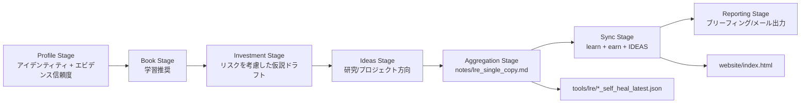
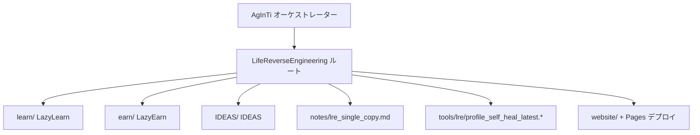

[English](../README.md) · [العربية](README.ar.md) · [Español](README.es.md) · [Français](README.fr.md) · [日本語](README.ja.md) · [한국어](README.ko.md) · [Tiếng Việt](README.vi.md) · [中文 (简体)](README.zh-Hans.md) · [中文（繁體）](README.zh-Hant.md) · [Deutsch](README.de.md) · [Русский](README.ru.md)

[](https://github.com/lachlanchen/lachlanchen/blob/main/figs/banner.png)

# LifeReverseEngineering

[](https://github.com/lachlanchen/LifeReverseEngineering)
[](https://lre.lazying.art/)
[](https://github.com/lachlanchen/LifeReverseEngineering/actions/workflows/static.yml)
[](#pipeline-logic)
[](#single-copy-output-policy)
[](#features)
[](#i18n)

LifeReverseEngineering（LRE）は、プロファイル文脈を3つの実行トラックにわたる実行可能な成果物へ変換する、個人向けのディープリサーチ用ワークスペースです。

- `learn`（LazyLearn）：読書計画と学習パス
- `earn`（LazyEarn）：投資アイデアと投資仮説の追跡
- `IDEAS`：研究方向とプロジェクト概念

このリポジトリは、単一コピー更新による反復実行を前提に設計されています。各サイクルで重複を延々と追記するのではなく、最新アーティファクトを更新します。

## 概要

LREは調整と集約のための基盤として機能し、各ドメインの実装の大部分はGitサブモジュール内にあります。

- `learn/`：学習および計算物理・計算化学の作業
- `earn/`：投資ブリーフ、PDF成果物、静的サイト出力
- `IDEAS/`：アイデアから公開までのワークフローと生成ドキュメントカタログ

ルートのLREは主に次を担います。

- パイプライン設計とオーケストレーション受け渡し
- `notes/` 内の単一コピー報告アーティファクト
- `tools/` 内の自己修復（self-heal）診断
- `website/` から `lre.lazying.art` へ公開されるルートのランディングページ

### クイックスコープマップ

| 領域                            | 主要パス                    | 責務                            |
| ------------------------------- | --------------------------- | ------------------------------- |
| 🧭 オーケストレーション受け渡し | ルートリポジトリ            | パイプライン設計 + 調整         |
| 📄 統合レポート                 | `notes/lre_single_copy.md`  | 最新1件のMarkdownブリーフィング |
| 🩺 診断                         | `tools/lre/`                | self-healスナップショットとログ |
| 🌐 公開ランディングページ       | `website/`                  | ルートGitHub Pagesデプロイ      |
| 🧠 ドメイン実行                 | `learn/`, `earn/`, `IDEAS/` | トラック別実装                  |

## ステータス

LREは稼働中で、次に最適化されています。

- 高頻度の反復更新
- エビデンスを考慮した研究要約
- リポジトリ横断の出力同期

### 現在の運用姿勢

| シグナル                    | 状態                                    |
| --------------------------- | --------------------------------------- |
| ルートパイプライン姿勢      | ✅ Active                               |
| ルートPagesデプロイ         | ✅ Enabled（`website/`）                |
| ルートi18n READMEバリアント | 🟡 ディレクトリは存在、ファイルは未整備 |
| 出力モデル                  | ✅ 単一コピーの上書き/更新              |

## Features

- 3トラック調整モデル（`learn`、`earn`、`IDEAS`）を、明確な責務境界で運用。
- 監査性の向上と運用ノイズ削減のための単一コピー出力ポリシー。
- `website/` のみを対象としたルートレベルGitHub Pagesデプロイ。
- デバッグおよびプロンプト/ツール進化のための、トラック単位self-healログスナップショット。
- 各トラックを独立進化させられるサブモジュールベース構成。
- ルートの `i18n/` ディレクトリは多言語READMEバリアント用に予約済み。

## コア構成

```text
LifeReverseEngineering/
├── learn/            # LazyLearn サブモジュール
├── earn/             # LazyEarn サブモジュール
├── IDEAS/            # IDEAS サブモジュール
├── notes/            # 統合出力（単一コピー報告）
├── tools/            # self-heal ログと補助アーティファクト
└── website/          # GitHub Pages 用静的サイト
```

拡張ルートマップ:

```text
LifeReverseEngineering/
├── README.md
├── .gitmodules
├── .github/
│   ├── FUNDING.yml
│   └── workflows/static.yml
├── website/
│   ├── index.html
│   ├── CNAME
│   └── logos/
├── notes/
│   └── lre_single_copy.md
├── tools/
│   └── lre/
│       ├── profile_self_heal_latest.json
│       └── profile_self_heal_latest.log
├── i18n/                 # 存在（現時点では空）
├── learn/                # サブモジュール
├── earn/                 # サブモジュール
└── IDEAS/                # サブモジュール
```

## Pipeline Logic

LREは段階的パイプラインとして実行されます（親リポジトリAgInTi内のプロンプトツールでオーケストレーション）。

1. Profile stage：アイデンティティアンカーとエビデンス信頼度を解決。
2. Book stage：成長重視の読書推奨を生成。
3. Investment stage：機会、リスク枠組み、投資仮説ノートを作成。
4. Ideas stage：次アクション付きの研究/プロジェクト方向を提案。
5. Aggregation stage：単一コピーMarkdownレポートを構築。
6. Sync stage：最新出力を `learn`、`earn`、`IDEAS` に反映。
7. Reporting stage：最終的なメール/ブリーフィング内容を生成。



### 実行時オーナーシップビュー



## Single-Copy Output Policy

このリポジトリでは、主要サマリーファイルに対して上書き/更新動作を採用しています。

- 主要ノートは常に最新1バージョンのみ保持。
- 旧 "latest" スナップショットは新しい実行出力で置換。
- self-heal診断は専用の tool/log パスに保持。

これにより、日次/定期実行をクリーンかつ監査可能で確認しやすい状態に保てます。

### 主要アーティファクトと挙動

| アーティファクト                          | 挙動                                        |
| ----------------------------------------- | ------------------------------------------- |
| `notes/lre_single_copy.md`                | 最新の統合レポートで上書き/更新             |
| `tools/lre/profile_self_heal_latest.json` | 最新のルートself-healスナップショットへ置換 |
| `tools/lre/profile_self_heal_latest.log`  | 最新診断ログを更新                          |

## 前提条件

- サブモジュール対応の `git` 2.30+（推奨）。
- `.gitmodules` に列挙されたサブモジュールへのGitHubアクセス。
- 現在のIDEASサブモジュールURLを使う場合は `git@github.com:lachlanchen/IDEAS.git` 用SSH鍵を設定。
- トラック作業に応じた任意ツール:
  - Python 3.x + Jupyterスタック（`learn/` ワークフロー）
  - `pandoc` + `xelatex`（`earn/` PDFワークフロー）
  - Node.js 18 と `latexmk`/`xelatex`（`IDEAS/` サイト + 公開ワークフロー）

## インストール

サブモジュール初期化込みでクローン:

```bash
git clone --recurse-submodules https://github.com/lachlanchen/LifeReverseEngineering.git
cd LifeReverseEngineering
```

サブモジュールなしで既にクローン済みの場合:

```bash
git submodule update --init --recursive
```

追跡先refにサブモジュールを同期:

```bash
git submodule sync --recursive
git submodule update --remote --recursive
```

## 使い方

典型的なルートレベル利用は、アプリ実行中心ではなくレポート中心です。

1. 最新の統合出力を確認:

```bash
sed -n '1,120p' notes/lre_single_copy.md
```

2. 最新のプロファイルself-heal診断を確認:

```bash
sed -n '1,160p' tools/lre/profile_self_heal_latest.json
sed -n '1,80p' tools/lre/profile_self_heal_latest.log
```

3. ルートWebサイトをローカルでプレビュー:

```bash
python3 -m http.server 8000 --directory website
# then open http://localhost:8000
```

4. ルートPagesデプロイ（`.github/workflows/static.yml`）をトリガーするには、`website/` の更新を `main` へプッシュします。

## 設定

### サブモジュール配線

`.gitmodules` で定義:

- `learn` -> `https://github.com/lachlanchen/LazyLearn.git`
- `earn` -> `https://github.com/lachlanchen/LazyEarn.git`
- `IDEAS` -> `git@github.com:lachlanchen/IDEAS.git`

### Webサイトとドメイン

- 静的サイトソース: `website/index.html`
- カスタムドメイン対象: `lre.lazying.art`（`website/CNAME` 由来）
- ルートデプロイワークフロー: `.github/workflows/static.yml`
- デプロイアーティファクト対象: `website/` のみ

### i18n

- ルートi18nディレクトリは存在: `i18n/`
- 現在の状態: ルート翻訳ファイルはまだなし
- サブモジュール（`learn`、`earn`、`IDEAS`）は各 `i18n/` ディレクトリで既に多言語READMEバリアントを維持
- ルートのlanguage-optionsポリシー: 各READMEバリアントの先頭行は1行に保ち、language-optionsヘッダーの重複を避ける

### 出力と診断

- 統合レポート: `notes/lre_single_copy.md`
- ルートself-healスナップショット: `tools/lre/profile_self_heal_latest.json`
- 関連するトラック別スナップショット:
  - `learn/tools/lre/books_self_heal_latest.json`
  - `earn/tools/lre/investments_self_heal_latest.json`
  - `IDEAS/tools/lre/ideas_self_heal_latest.json`

## 例

### 例: 実行結果の鮮度を確認

```bash
ls -lt notes/lre_single_copy.md tools/lre/profile_self_heal_latest.json
```

### 例: 弱シグナル診断をすばやく監査

```bash
rg -n "weak|anchor|identity|non_empty" tools/lre/profile_self_heal_latest.json
```

### 例: `IDEAS/ideas/*.md` 変更後にIDEAドキュメントを更新

```bash
cd IDEAS
npm install --no-save marked
node scripts/generate_site.mjs
```

### 例: ルートWebサイトを再生成して公開

```bash
# edit website/index.html
git add website/index.html .github/workflows/static.yml
git commit -m "Update LRE website"
git push origin main
```

## 開発ノート

- このリポジトリは調整レイヤーであり、単一のパッケージ化アプリケーションではありません。
- 現時点でルートに `package.json`、`pyproject.toml`、統一lockfileはありません。
- ルートCIはテスト/lint中心ではなくデプロイ（Pages）中心です。
- 段階オーケストレーションスクリプトはこのリポジトリではなく、親AgInTiリポジトリに存在する前提です。
- Webサイトは意図的に静的アセットを使用し、ルートにビルドステップを置いていません。

## トラブルシューティング

| 症状                                                   | 確認 / 対処                                                                                                     |
| ------------------------------------------------------ | --------------------------------------------------------------------------------------------------------------- |
| クローン後にサブモジュールが空                         | `git submodule update --init --recursive` を実行。                                                              |
| IDEASサブモジュール認証が失敗する                      | `git@github.com:lachlanchen/IDEAS.git` へのGitHub SSH鍵アクセスを確認。必要ならサブモジュールURLをHTTPSへ切替。 |
| ルートPagesサイトが更新されない                        | 変更ファイルが `website/**` または `.github/workflows/static.yml` 配下か、ブランチが `main` かを確認。          |
| ローカルでは表示されるがカスタムドメインで表示されない | `website/CNAME` に `lre.lazying.art` が含まれ、DNSがGitHub Pagesへ正しく向いているか確認。                      |
| self-healレポートが古く見える                          | `tools/lre/` のファイル更新時刻と `notes/lre_single_copy.md` の実行IDを確認。                                   |
| ログにロケール警告（例: `LC_ALL=C.UTF-8`）が出る       | 多くは環境レベルの警告で、レポート生成には致命的ではありません。                                                |

## ロードマップ

- ルート `i18n/` 配下に多言語READMEバリアントを追加し、言語オプションを同期維持。
- ルートレベル整合性チェック（リンク検証 + アーティファクト鮮度チェック）を追加。
- self-healスナップショットに基づく、トラック横断のエビデンス品質ダッシュボードを改善。
- AgInTi -> LRE の親オーケストレーター受け渡し契約を明確化・自動化。
- 弱シグナル再発シナリオ向けのトラブルシューティング手順を拡張。

## 関連リポジトリ

- AgInTi: オーケストレーションおよびプロンプトツールシステム。
- LazyLearn（`learn/`）: 学習・読書出力。
- LazyEarn（`earn/`）: 投資出力。
- IDEAS（`IDEAS/`）: 研究/アイデア出力。

## コントリビューション

次の改善への貢献を歓迎します。

- ルートパイプライン文書の改善
- 診断とアーティファクト品質チェックの強化
- Webサイトの明瞭性と運用透明性の向上
- 一貫フォーマットでのルートi18n READMEバリアント追加

推奨プロセス:

1. 対象範囲と影響トラックを記したIssueを作成。
2. 変更は適切なレイヤー（`root` vs `learn`/`earn`/`IDEAS`）に限定。
3. ワークフローやコマンドを変更する場合は before/after メモを添付。
4. デプロイ挙動に触れる場合は、正確なパスとトリガー影響を明記。

## サポート

資金提供・サポートリンク（`.github/FUNDING.yml` より）:

- GitHub Sponsors: [https://github.com/sponsors/lachlanchen](https://github.com/sponsors/lachlanchen)
- プロジェクトネットワーク: [https://lazying.art](https://lazying.art)
- コミュニティ/チャット: [https://chat.lazying.art](https://chat.lazying.art)
- 関連イニシアチブ: [https://onlyideas.art](https://onlyideas.art)

## ライセンス

2026年3月3日時点で、このリポジトリのルートには `LICENSE` ファイルが存在しません。

前提: ライセンスが追加されるまでは、GitHub上の標準的な可視性期待を超える利用権は明示的に付与されません。再利用条件を明確にするには `LICENSE` ファイルを追加してください。
