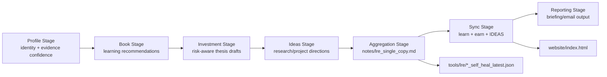
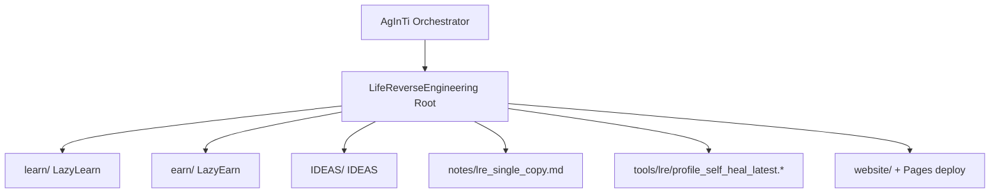

[English](../README.md) · [العربية](README.ar.md) · [Español](README.es.md) · [Français](README.fr.md) · [日本語](README.ja.md) · [한국어](README.ko.md) · [Tiếng Việt](README.vi.md) · [中文 (简体)](README.zh-Hans.md) · [中文（繁體）](README.zh-Hant.md) · [Deutsch](README.de.md) · [Русский](README.ru.md)

[](https://github.com/lachlanchen/lachlanchen/blob/main/figs/banner.png)

# LifeReverseEngineering

[](https://github.com/lachlanchen/LifeReverseEngineering)
[](https://lre.lazying.art/)
[](https://github.com/lachlanchen/LifeReverseEngineering/actions/workflows/static.yml)
[](#pipeline-logic)
[](#single-copy-output-policy)
[](#features)
[](#i18n)

LifeReverseEngineering(LRE)는 프로필 컨텍스트를 세 가지 실행 트랙의 실행 가능한 결과물로 전환하는 개인용 딥 리서치 워크스페이스입니다.

- `learn` (LazyLearn): 도서 계획과 학습 경로
- `earn` (LazyEarn): 투자 아이디어와 테제 추적
- `IDEAS`: 연구 방향과 프로젝트 콘셉트

이 저장소는 단일 사본 업데이트 방식의 반복 실행을 전제로 설계되어, 사이클마다 중복을 계속 누적하지 않고 최신 산출물만 갱신합니다.

## 개요

LRE는 조율 및 집계 계층 역할을 하며, 도메인별 실제 구현의 대부분은 Git 서브모듈 내부에 있습니다.

- `learn/`: 학습 및 계산 물리/화학 작업
- `earn/`: 투자 브리프, PDF 산출물, 정적 사이트 결과물
- `IDEAS/`: 아이디어-출판 워크플로와 생성 문서 카탈로그

루트 레벨에서 LRE는 다음에 집중합니다.

- 파이프라인 프레이밍과 오케스트레이션 핸드오프
- `notes/`의 단일 사본 보고서 산출물
- `tools/`의 self-heal 진단
- `website/`에서 `lre.lazying.art`로 배포되는 루트 랜딩 페이지

### 빠른 범위 맵

| 영역                       | 주요 경로                   | 책임                       |
| -------------------------- | --------------------------- | -------------------------- |
| 🧭 오케스트레이션 핸드오프 | 루트 저장소                 | 파이프라인 프레이밍 + 조율 |
| 📄 통합 보고서             | `notes/lre_single_copy.md`  | 최신 단일 마크다운 브리핑  |
| 🩺 진단                    | `tools/lre/`                | self-heal 스냅샷 및 로그   |
| 🌐 공개 랜딩 페이지        | `website/`                  | 루트 GitHub Pages 배포     |
| 🧠 도메인 실행             | `learn/`, `earn/`, `IDEAS/` | 트랙별 구현                |

## 상태

LRE는 현재 활성 상태이며, 다음에 최적화되어 있습니다.

- 고빈도 반복 업데이트
- 증거 인식형 리서치 요약
- 저장소 간 산출물 동기화

### 현재 운영 상태

| 신호                  | 상태                                  |
| --------------------- | ------------------------------------- |
| 루트 파이프라인 상태  | ✅ 활성                               |
| 루트 Pages 배포       | ✅ 활성화 (`website/`)                |
| 루트 i18n README 변형 | 🟡 디렉터리는 있으나 파일은 대기 상태 |
| 출력 모델             | ✅ 단일 사본 덮어쓰기/업데이트        |

<a id="features"></a>

## 기능

- 책임 경계가 명확한 3트랙 조율 모델(`learn`, `earn`, `IDEAS`).
- 더 깔끔한 감사와 낮은 운영 노이즈를 위한 단일 사본 출력 정책.
- 루트 레벨 GitHub Pages는 `website/`에서만 배포.
- 디버깅 및 프롬프트/도구 진화를 위한 트랙별 self-heal 로그 스냅샷.
- 각 트랙이 독립적으로 진화할 수 있는 서브모듈 기반 아키텍처.
- 다국어 README 변형을 위해 예약된 루트 `i18n/` 디렉터리.

## 핵심 구조

```text
LifeReverseEngineering/
├── learn/            # LazyLearn submodule
├── earn/             # LazyEarn submodule
├── IDEAS/            # IDEAS submodule
├── notes/            # consolidated outputs (single-copy reports)
├── tools/            # self-heal logs and helper artifacts
└── website/          # static website for GitHub Pages
```

확장된 루트 맵:

```text
LifeReverseEngineering/
├── README.md
├── .gitmodules
├── .github/
│   ├── FUNDING.yml
│   └── workflows/static.yml
├── website/
│   ├── index.html
│   ├── CNAME
│   └── logos/
├── notes/
│   └── lre_single_copy.md
├── tools/
│   └── lre/
│       ├── profile_self_heal_latest.json
│       └── profile_self_heal_latest.log
├── i18n/                 # exists, currently empty
├── learn/                # submodule
├── earn/                 # submodule
└── IDEAS/                # submodule
```

<a id="pipeline-logic"></a>

## 파이프라인 로직

LRE는 단계형 파이프라인으로 실행됩니다(상위 AgInTi 저장소의 프롬프트 도구가 오케스트레이션).

1. Profile 단계: 정체성 앵커와 증거 신뢰도를 해석.
2. Book 단계: 성장 중심 독서 추천 생성.
3. Investment 단계: 기회, 리스크 프레이밍, 테제 노트 초안 작성.
4. Ideas 단계: 다음 액션을 포함한 연구/프로젝트 방향 제안.
5. Aggregation 단계: 단일 사본 마크다운 보고서 생성.
6. Sync 단계: 최신 산출물을 `learn`, `earn`, `IDEAS`에 기록.
7. Reporting 단계: 최종 이메일/브리핑 콘텐츠 생성.



### 런타임 소유권 뷰



<a id="single-copy-output-policy"></a>

## 단일 사본 출력 정책

이 저장소는 핵심 요약 파일에 대해 덮어쓰기/업데이트 동작을 따릅니다.

- 주요 노트는 현재 버전 1개만 유지합니다.
- 이전 "latest" 스냅샷은 새 실행 산출물로 대체합니다.
- self-heal 진단은 전용 도구/로그 경로에 유지합니다.

이 방식은 일간/주기 실행을 깔끔하고 감사 가능하며 점검하기 쉽게 만듭니다.

### 핵심 산출물과 동작

| 산출물                                    | 동작                                 |
| ----------------------------------------- | ------------------------------------ |
| `notes/lre_single_copy.md`                | 최신 통합 보고서로 덮어쓰기/업데이트 |
| `tools/lre/profile_self_heal_latest.json` | 최신 루트 self-heal 스냅샷으로 교체  |
| `tools/lre/profile_self_heal_latest.log`  | 최신 진단 로그로 업데이트            |

## 사전 요구사항

- 서브모듈을 지원하는 `git` 2.30+ (권장)
- `.gitmodules`에 나열된 서브모듈에 대한 GitHub 접근 권한
- 현재 IDEAS 서브모듈 URL을 사용할 경우 `git@github.com:lachlanchen/IDEAS.git`용 SSH 키 구성
- 트랙 작업에 따라 선택적으로 필요한 도구:
  - Python 3.x + Jupyter 스택 (`learn/` 워크플로)
  - `pandoc` + `xelatex` (`earn/` PDF 워크플로)
  - Node.js 18 및 `latexmk`/`xelatex` (`IDEAS/` 사이트 + 출판 워크플로)

## 설치

서브모듈을 초기화하여 클론:

```bash
git clone --recurse-submodules https://github.com/lachlanchen/LifeReverseEngineering.git
cd LifeReverseEngineering
```

이미 서브모듈 없이 클론한 경우:

```bash
git submodule update --init --recursive
```

서브모듈을 추적 참조와 동기화 상태로 유지:

```bash
git submodule sync --recursive
git submodule update --remote --recursive
```

## 사용법

일반적인 루트 레벨 사용 패턴은 앱 런타임 중심이 아니라 보고서 중심입니다.

1. 최신 통합 출력 확인:

```bash
sed -n '1,120p' notes/lre_single_copy.md
```

2. 최신 프로필 self-heal 진단 확인:

```bash
sed -n '1,160p' tools/lre/profile_self_heal_latest.json
sed -n '1,80p' tools/lre/profile_self_heal_latest.log
```

3. 로컬에서 루트 웹사이트 미리보기:

```bash
python3 -m http.server 8000 --directory website
# then open http://localhost:8000
```

4. 루트 Pages 배포를 트리거하려면 `website/` 업데이트를 `main`에 푸시(`.github/workflows/static.yml`).

## 구성

### 서브모듈 연결

`.gitmodules`에 정의되어 있습니다.

- `learn` -> `https://github.com/lachlanchen/LazyLearn.git`
- `earn` -> `https://github.com/lachlanchen/LazyEarn.git`
- `IDEAS` -> `git@github.com:lachlanchen/IDEAS.git`

### 웹사이트 및 도메인

- 정적 사이트 소스: `website/index.html`
- 커스텀 도메인 대상: `lre.lazying.art` (`website/CNAME`)
- 루트 배포 워크플로: `.github/workflows/static.yml`
- 배포 아티팩트 범위: `website/`만

### i18n

- 루트 i18n 디렉터리 존재: `i18n/`
- 현재 상태: 루트 번역 파일 아직 없음
- 서브모듈(`learn`, `earn`, `IDEAS`)은 각자의 `i18n/` 디렉터리에서 이미 다국어 README 변형을 유지
- 루트 언어 옵션 정책: 각 README 변형 맨 위에 단일 한 줄을 유지하고 언어 옵션 헤더 중복을 피함

### 출력 및 진단

- 통합 보고서: `notes/lre_single_copy.md`
- 루트 self-heal 스냅샷: `tools/lre/profile_self_heal_latest.json`
- 관련 트랙별 스냅샷:
  - `learn/tools/lre/books_self_heal_latest.json`
  - `earn/tools/lre/investments_self_heal_latest.json`
  - `IDEAS/tools/lre/ideas_self_heal_latest.json`

## 예시

### 예시: 실행 최신성 확인

```bash
ls -lt notes/lre_single_copy.md tools/lre/profile_self_heal_latest.json
```

### 예시: 약한 신호 진단 빠르게 감사

```bash
rg -n "weak|anchor|identity|non_empty" tools/lre/profile_self_heal_latest.json
```

### 예시: `IDEAS/ideas/*.md` 변경 후 IDEAS 문서 업데이트

```bash
cd IDEAS
npm install --no-save marked
node scripts/generate_site.mjs
```

### 예시: 루트 웹사이트 재생성 및 게시

```bash
# edit website/index.html
git add website/index.html .github/workflows/static.yml
git commit -m "Update LRE website"
git push origin main
```

## 개발 노트

- 이 저장소는 단일 패키지 애플리케이션이 아니라 조율 계층입니다.
- 현재 루트에는 `package.json`, `pyproject.toml`, 통합 lockfile이 없습니다.
- 루트 CI는 테스트/린트 중심이 아니라 배포(Pages) 중심입니다.
- 단계형 오케스트레이션 스크립트는 이 저장소가 아니라 상위 AgInTi 저장소에 있는 것으로 참조됩니다.
- 웹사이트는 의도적으로 정적 자산만 사용하며 루트 빌드 단계가 없습니다.

## 문제 해결

| 증상                                                     | 확인 / 해결                                                                                                               |
| -------------------------------------------------------- | ------------------------------------------------------------------------------------------------------------------------- |
| 클론 후 서브모듈이 비어 있음                             | `git submodule update --init --recursive`를 실행하세요.                                                                   |
| IDEAS 서브모듈 인증 실패                                 | `git@github.com:lachlanchen/IDEAS.git`에 대한 GitHub SSH 키 접근을 확인하거나, 필요 시 서브모듈 URL을 HTTPS로 전환하세요. |
| 루트 Pages 사이트가 업데이트되지 않음                    | 변경 파일이 `website/**` 또는 `.github/workflows/static.yml` 아래인지, 브랜치가 `main`인지 확인하세요.                    |
| 로컬에서는 웹사이트가 보이나 커스텀 도메인에서는 안 보임 | `website/CNAME`에 `lre.lazying.art`가 포함되어 있는지, DNS가 GitHub Pages를 올바르게 가리키는지 확인하세요.               |
| Self-heal 보고서가 오래된 것처럼 보임                    | `tools/lre/`의 파일 수정 시간과 `notes/lre_single_copy.md`의 실행 ID를 확인하세요.                                        |
| 로그에 로케일 경고(예: `LC_ALL=C.UTF-8`)가 표시됨        | 일반적으로 환경 수준 이슈이며 보고서 생성에는 치명적이지 않습니다.                                                        |

## 로드맵

- `i18n/` 아래에 루트 다국어 README 변형을 추가하고 언어 옵션을 동기화 상태로 유지.
- 루트 레벨 무결성 검사(링크 검증 + 산출물 최신성 검사) 추가.
- self-heal 스냅샷 기반의 트랙 간 증거 품질 대시보드 개선.
- AgInTi -> LRE 상위 오케스트레이터 핸드오프 계약을 명확화하고 자동화.
- 반복되는 약한 신호 시나리오를 위한 문제 해결 플레이북 확장.

## 관련 저장소

- AgInTi: 오케스트레이션 및 프롬프트-도구 시스템.
- LazyLearn (`learn/`): 학습 및 독서 산출물.
- LazyEarn (`earn/`): 투자 산출물.
- IDEAS (`IDEAS/`): 연구/아이디어 산출물.

## 기여

다음 영역의 기여를 환영합니다.

- 루트 파이프라인 문서 개선
- 진단 및 산출물 품질 검증 강화
- 웹사이트 명확성과 운영 투명성 향상
- 일관된 형식의 루트 i18n README 변형 추가

권장 프로세스:

1. 범위와 영향받는 트랙을 설명하는 이슈를 먼저 생성합니다.
2. 변경 범위는 올바른 레이어(`root` vs `learn`/`earn`/`IDEAS`)로 제한합니다.
3. 워크플로 또는 명령 변경 시 전/후 노트를 포함합니다.
4. 배포 동작을 건드리는 경우 정확한 경로와 트리거 영향을 명시합니다.

## 지원

후원 및 지원 링크(`.github/FUNDING.yml` 기준):

- GitHub Sponsors: [https://github.com/sponsors/lachlanchen](https://github.com/sponsors/lachlanchen)
- Project network: [https://lazying.art](https://lazying.art)
- Community/chat: [https://chat.lazying.art](https://chat.lazying.art)
- Related initiative: [https://onlyideas.art](https://onlyideas.art)

## 라이선스

이 저장소에는 2026년 3월 3일 기준 루트 `LICENSE` 파일이 없습니다.

가정: 라이선스가 추가되기 전까지는 표준 GitHub 공개 범위를 넘어서는 사용 권한이 명시적으로 부여되지 않습니다. 재사용 조건을 명확히 하려면 `LICENSE` 파일을 추가하세요.
