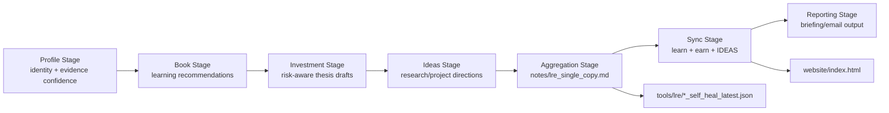
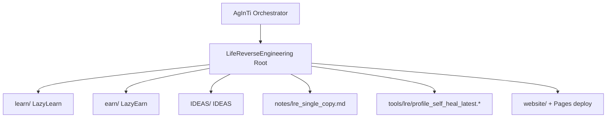

[English](../README.md) · [العربية](README.ar.md) · [Español](README.es.md) · [Français](README.fr.md) · [日本語](README.ja.md) · [한국어](README.ko.md) · [Tiếng Việt](README.vi.md) · [中文 (简体)](README.zh-Hans.md) · [中文（繁體）](README.zh-Hant.md) · [Deutsch](README.de.md) · [Русский](README.ru.md)


# LifeReverseEngineering

[](https://github.com/lachlanchen/LifeReverseEngineering)
[](https://lre.lazying.art/)
[](https://github.com/lachlanchen/LifeReverseEngineering/actions/workflows/static.yml)
[](#pipeline-logic)
[](#single-copy-output-policy)
[](#features)
[](#i18n)

LifeReverseEngineering (LRE) — это персональное пространство для глубинных исследований, которое превращает контекст профиля в практические результаты по трем направлениям выполнения:

- `learn` (LazyLearn): книжные планы и траектории обучения
- `earn` (LazyEarn): инвестиционные идеи и отслеживание тезисов
- `IDEAS`: исследовательские направления и концепции проектов

Репозиторий спроектирован для итеративных запусков с обновлением в формате single-copy, поэтому в каждом цикле освежаются последние артефакты, а не бесконечно добавляются дубликаты.

## Обзор

LRE выступает слоем координации и агрегации, тогда как большая часть предметной реализации находится внутри Git-сабмодулей:

- `learn/` для обучения и задач вычислительной физики/химии
- `earn/` для инвестиционных обзоров, PDF-артефактов и вывода статического сайта
- `IDEAS/` для процессов от идеи до публикации и сгенерированных каталогов документации

На корневом уровне LRE фокусируется на:

- рамке пайплайна и передаче оркестрации
- single-copy артефактах отчетов в `notes/`
- self-heal диагностике в `tools/`
- корневой лендинговой странице, публикуемой из `website/` на `lre.lazying.art`

### Быстрая карта охвата

| Область | Основной путь | Ответственность |
|---|---|---|
| 🧭 Передача оркестрации | Корневой репозиторий | Рамка пайплайна + координация |
| 📄 Консолидированный отчет | `notes/lre_single_copy.md` | Единый актуальный markdown-бриф |
| 🩺 Диагностика | `tools/lre/` | Self-heal снимки и логи |
| 🌐 Публичная лендинговая страница | `website/` | Корневой деплой GitHub Pages |
| 🧠 Предметное выполнение | `learn/`, `earn/`, `IDEAS/` | Реализация по направлениям |

## Статус

LRE активен и оптимизирован для:

- высокочастотных итеративных обновлений
- исследовательских сводок с учетом доказательной базы
- синхронизации результатов между репозиториями

### Текущая операционная позиция

| Сигнал | Состояние |
|---|---|
| Состояние корневого пайплайна | ✅ Активен |
| Деплой корневого Pages | ✅ Включен (`website/`) |
| Корневые i18n-варианты README | 🟡 Каталог есть, файлы в ожидании |
| Модель вывода | ✅ Single-copy overwrite/update |

<a id="features"></a>

## Возможности

- Трехтрековая модель координации (`learn`, `earn`, `IDEAS`) с четкими границами ответственности.
- Политика single-copy вывода для более чистого аудита и меньшего операционного шума.
- Корневой деплой GitHub Pages только из `website/`.
- Лог-снимки self-heal на уровне треков для отладки и эволюции prompt/tool-процессов.
- Архитектура на сабмодулях, чтобы каждый трек мог развиваться независимо.
- Существующий корневой каталог `i18n/`, зарезервированный под многоязычные варианты README.

## Базовая структура

```text
LifeReverseEngineering/
├── learn/            # LazyLearn submodule
├── earn/             # LazyEarn submodule
├── IDEAS/            # IDEAS submodule
├── notes/            # consolidated outputs (single-copy reports)
├── tools/            # self-heal logs and helper artifacts
└── website/          # static website for GitHub Pages
```

Расширенная карта корня:

```text
LifeReverseEngineering/
├── README.md
├── .gitmodules
├── .github/
│   ├── FUNDING.yml
│   └── workflows/static.yml
├── website/
│   ├── index.html
│   ├── CNAME
│   └── logos/
├── notes/
│   └── lre_single_copy.md
├── tools/
│   └── lre/
│       ├── profile_self_heal_latest.json
│       └── profile_self_heal_latest.log
├── i18n/                 # exists, currently empty
├── learn/                # submodule
├── earn/                 # submodule
└── IDEAS/                # submodule
```

<a id="pipeline-logic"></a>

## Логика пайплайна

LRE работает как поэтапный пайплайн (оркеструется prompt-инструментами в родительском репозитории AgInTi):

1. Этап Profile: определение identity anchors и confidence по evidence.
2. Этап Book: генерация ориентированных на развитие рекомендаций по чтению.
3. Этап Investment: формирование возможностей, рамки рисков и заметок по тезисам.
4. Этап Ideas: предложения исследовательских/проектных направлений с последующими действиями.
5. Этап Aggregation: сборка single-copy markdown-отчета.
6. Этап Sync: запись последних результатов в `learn`, `earn` и `IDEAS`.
7. Этап Reporting: формирование финального контента для email/брифа.



### Представление владения во время выполнения



<a id="single-copy-output-policy"></a>

## Политика single-copy вывода

Этот репозиторий использует поведение overwrite/update для ключевых сводных файлов:

- Хранить одну текущую версию основных заметок.
- Заменять старые снимки `latest` результатами нового запуска.
- Хранить self-heal диагностику в выделенных путях tools/log.

Это делает ежедневные/периодические запуски чистыми, удобными для аудита и простыми для проверки.

### Ключевые артефакты и поведение

| Артефакт | Поведение |
|---|---|
| `notes/lre_single_copy.md` | Перезаписывается/обновляется последним консолидированным отчетом |
| `tools/lre/profile_self_heal_latest.json` | Заменяется последним снимком root self-heal |
| `tools/lre/profile_self_heal_latest.log` | Обновляется последним диагностическим логом |

## Предварительные требования

- `git` 2.30+ (рекомендуется) с поддержкой сабмодулей.
- Доступ GitHub к сабмодулям, перечисленным в `.gitmodules`.
- Настроенный SSH-ключ для `git@github.com:lachlanchen/IDEAS.git`, если используется текущий URL сабмодуля IDEAS.
- Дополнительные инструменты в зависимости от работы трека:
  - Python 3.x + стек Jupyter (процессы `learn/`)
  - `pandoc` + `xelatex` (PDF-процесс `earn/`)
  - Node.js 18 и `latexmk`/`xelatex` (процессы сайта и публикаций `IDEAS/`)

## Установка

Клонирование с инициализацией сабмодулей:

```bash
git clone --recurse-submodules https://github.com/lachlanchen/LifeReverseEngineering.git
cd LifeReverseEngineering
```

Если репозиторий уже клонирован без сабмодулей:

```bash
git submodule update --init --recursive
```

Поддерживайте сабмодули синхронизированными с отслеживаемыми refs:

```bash
git submodule sync --recursive
git submodule update --remote --recursive
```

## Использование

Типичный корневой сценарий использования ориентирован на отчеты, а не на runtime приложения.

1. Просмотр последнего консолидированного вывода:

```bash
sed -n '1,120p' notes/lre_single_copy.md
```

2. Просмотр последней profile self-heal диагностики:

```bash
sed -n '1,160p' tools/lre/profile_self_heal_latest.json
sed -n '1,80p' tools/lre/profile_self_heal_latest.log
```

3. Локальный предпросмотр корневого сайта:

```bash
python3 -m http.server 8000 --directory website
# then open http://localhost:8000
```

4. Отправьте обновления `website/` в `main`, чтобы запустить деплой root Pages (`.github/workflows/static.yml`).

## Конфигурация

### Связка сабмодулей

Определена в `.gitmodules`:

- `learn` -> `https://github.com/lachlanchen/LazyLearn.git`
- `earn` -> `https://github.com/lachlanchen/LazyEarn.git`
- `IDEAS` -> `git@github.com:lachlanchen/IDEAS.git`

### Сайт и домен

- Источник статического сайта: `website/index.html`
- Целевой кастомный домен: `lre.lazying.art` (из `website/CNAME`)
- Корневой workflow деплоя: `.github/workflows/static.yml`
- Область deployment artifact: только `website/`

### i18n

- Корневой каталог i18n существует: `i18n/`
- Текущее состояние: корневых файлов перевода пока нет
- Сабмодули (`learn`, `earn`, `IDEAS`) уже поддерживают многоязычные варианты README в собственных каталогах `i18n/`
- Политика language-options на уровне root: поддерживать единственную верхнюю строку в каждом варианте README и избегать дублирующихся заголовков language-options

### Вывод и диагностика

- Консолидированный отчет: `notes/lre_single_copy.md`
- Корневой self-heal снимок: `tools/lre/profile_self_heal_latest.json`
- Связанные снимки по трекам:
  - `learn/tools/lre/books_self_heal_latest.json`
  - `earn/tools/lre/investments_self_heal_latest.json`
  - `IDEAS/tools/lre/ideas_self_heal_latest.json`

## Примеры

### Пример: проверить свежесть запуска

```bash
ls -lt notes/lre_single_copy.md tools/lre/profile_self_heal_latest.json
```

### Пример: быстро проверить диагностику слабых сигналов

```bash
rg -n "weak|anchor|identity|non_empty" tools/lre/profile_self_heal_latest.json
```

### Пример: обновить документацию IDEA после изменения `IDEAS/ideas/*.md`

```bash
cd IDEAS
npm install --no-save marked
node scripts/generate_site.mjs
```

### Пример: пересобрать и опубликовать корневой сайт

```bash
# edit website/index.html
git add website/index.html .github/workflows/static.yml
git commit -m "Update LRE website"
git push origin main
```

## Примечания по разработке

- Этот репозиторий является координационным слоем, а не единым упакованным приложением.
- В корне сейчас нет `package.json`, `pyproject.toml` или единого lockfile.
- Корневой CI сфокусирован на деплое (Pages), а не на тестах/линтинге.
- Поэтапные скрипты оркестрации упоминаются как находящиеся в родительском репозитории AgInTi, а не в этом репозитории.
- Сайт на корне намеренно использует статические ресурсы без шага сборки.

## Устранение неполадок

| Симптом | Проверка / исправление |
|---|---|
| Сабмодуль пуст после клонирования | Выполните `git submodule update --init --recursive`. |
| Сбой аутентификации сабмодуля IDEAS | Убедитесь, что есть доступ по GitHub SSH-ключу для `git@github.com:lachlanchen/IDEAS.git`, или при необходимости переключите URL сабмодуля на HTTPS. |
| Корневой сайт Pages не обновился | Проверьте, что измененные файлы находятся в `website/**` или `.github/workflows/static.yml`, а ветка — `main`. |
| Сайт локально рендерится, но не на кастомном домене | Проверьте, что `website/CNAME` содержит `lre.lazying.art`, а DNS корректно указывает на GitHub Pages. |
| Self-heal отчет выглядит устаревшим | Проверьте время изменения файлов в `tools/lre/` и run ID в `notes/lre_single_copy.md`. |
| В логах появляются предупреждения локали (например, `LC_ALL=C.UTF-8`) | Обычно это уровень окружения и не является фатальным для генерации отчетов. |

## Дорожная карта

- Добавить корневые многоязычные варианты README в `i18n/` и поддерживать синхронизацию language options.
- Добавить проверки целостности на уровне root (верификация ссылок + проверки свежести артефактов).
- Улучшить кросс-трековые панели качества evidence на основе self-heal снимков.
- Уточнить и автоматизировать контракты передачи от родительского оркестратора из AgInTi в LRE.
- Расширить playbook по устранению повторяющихся сценариев слабых сигналов.

## Связанные репозитории

- AgInTi: система оркестрации и prompt-tools.
- LazyLearn (`learn/`): обучающие и читательские результаты.
- LazyEarn (`earn/`): инвестиционные результаты.
- IDEAS (`IDEAS/`): исследовательские/идеевые результаты.

## Вклад

Приветствуются вклад и улучшения в следующих областях:

- улучшение документации корневого пайплайна
- усиление диагностики и проверок качества артефактов
- повышение ясности сайта и операционной прозрачности
- добавление корневых i18n-вариантов README в согласованном формате

Рекомендуемый процесс:

1. Откройте issue с описанием области работ и затронутых треков.
2. Держите изменения в рамках правильного слоя (`root` vs `learn`/`earn`/`IDEAS`).
3. Добавляйте заметки до/после для любых изменений workflow или команд.
4. Если меняете поведение деплоя, указывайте точный путь и влияние на триггеры.

## Поддержка

Ссылки на финансирование и поддержку (из `.github/FUNDING.yml`):

- GitHub Sponsors: [https://github.com/sponsors/lachlanchen](https://github.com/sponsors/lachlanchen)
- Сеть проектов: [https://lazying.art](https://lazying.art)
- Сообщество/чат: [https://chat.lazying.art](https://chat.lazying.art)
- Связанная инициатива: [https://onlyideas.art](https://onlyideas.art)

## Лицензия

В этом репозитории на корневом уровне отсутствует файл `LICENSE` по состоянию на 3 марта 2026 года.

Предположение: пока лицензия не добавлена, права на использование явно не предоставлены сверх стандартных ожиданий видимости на GitHub. Добавьте файл `LICENSE`, чтобы явно определить условия повторного использования.
