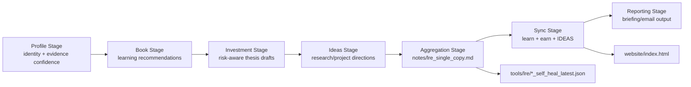
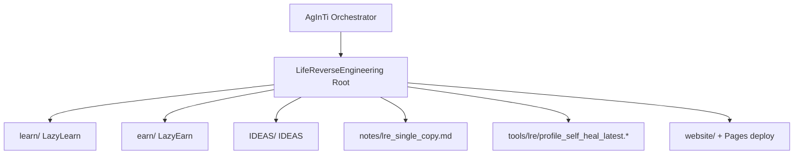

[English](../README.md) · [العربية](README.ar.md) · [Español](README.es.md) · [Français](README.fr.md) · [日本語](README.ja.md) · [한국어](README.ko.md) · [Tiếng Việt](README.vi.md) · [中文 (简体)](README.zh-Hans.md) · [中文（繁體）](README.zh-Hant.md) · [Deutsch](README.de.md) · [Русский](README.ru.md)


# LifeReverseEngineering

[](https://github.com/lachlanchen/LifeReverseEngineering)
[](https://lre.lazying.art/)
[](https://github.com/lachlanchen/LifeReverseEngineering/actions/workflows/static.yml)
[](#pipeline-logic)
[](#single-copy-output-policy)
[](#features)
[](#i18n)

LifeReverseEngineering (LRE) là một workspace nghiên cứu chuyên sâu cá nhân, chuyển ngữ cảnh hồ sơ thành các đầu ra có thể hành động trên ba tuyến thực thi:

- `learn` (LazyLearn): kế hoạch đọc sách và lộ trình học tập
- `earn` (LazyEarn): ý tưởng đầu tư và theo dõi luận điểm
- `IDEAS`: hướng nghiên cứu và ý tưởng dự án

Kho lưu trữ này được thiết kế cho các lần chạy lặp với cơ chế cập nhật single-copy, nên mỗi vòng chạy sẽ làm mới các tạo phẩm mới nhất thay vì nối thêm bản trùng lặp vô hạn.

## Tổng quan

LRE đóng vai trò bề mặt điều phối và tổng hợp, trong khi phần lớn triển khai theo miền nằm trong các Git submodule:

- `learn/` cho công việc học tập và vật lý/hóa học tính toán
- `earn/` cho brief đầu tư, tạo phẩm PDF và đầu ra site tĩnh
- `IDEAS/` cho quy trình từ ý tưởng đến xuất bản và danh mục tài liệu được tạo

Ở mức root, LRE tập trung vào:

- định khung pipeline và bàn giao điều phối
- tạo phẩm báo cáo single-copy trong `notes/`
- chẩn đoán self-heal trong `tools/`
- trang đích root triển khai từ `website/` lên `lre.lazying.art`

### Bản đồ phạm vi nhanh

| Khu vực | Đường dẫn chính | Trách nhiệm |
|---|---|---|
| 🧭 Bàn giao điều phối | Root repo | Định khung pipeline + điều phối |
| 📄 Báo cáo hợp nhất | `notes/lre_single_copy.md` | Bản briefing markdown mới nhất duy nhất |
| 🩺 Chẩn đoán | `tools/lre/` | Snapshot self-heal và log |
| 🌐 Trang đích công khai | `website/` | Triển khai root GitHub Pages |
| 🧠 Thực thi theo miền | `learn/`, `earn/`, `IDEAS/` | Triển khai theo từng track |

## Trạng thái

LRE đang hoạt động và được tối ưu cho:

- cập nhật lặp với tần suất cao
- tóm tắt nghiên cứu có cân nhắc bằng chứng
- đồng bộ đầu ra xuyên kho lưu trữ

### Tư thế vận hành hiện tại

| Tín hiệu | Trạng thái |
|---|---|
| Tư thế pipeline root | ✅ Active |
| Triển khai Pages root | ✅ Enabled (`website/`) |
| Các biến thể README i18n root | 🟡 Directory present, files pending |
| Mô hình đầu ra | ✅ Single-copy overwrite/update |

## Tính năng

- Mô hình điều phối ba track (`learn`, `earn`, `IDEAS`) với ranh giới trách nhiệm rõ ràng.
- Chính sách đầu ra single-copy giúp audit gọn hơn và giảm nhiễu vận hành.
- Triển khai GitHub Pages ở mức root chỉ từ `website/`.
- Snapshot log self-heal ở từng track để debug và cải tiến prompt/tool.
- Kiến trúc dựa trên submodule để từng track có thể phát triển độc lập.
- Thư mục root `i18n/` hiện có được dành riêng cho các biến thể README đa ngôn ngữ.

## Cấu trúc cốt lõi

```text
LifeReverseEngineering/
├── learn/            # LazyLearn submodule
├── earn/             # LazyEarn submodule
├── IDEAS/            # IDEAS submodule
├── notes/            # consolidated outputs (single-copy reports)
├── tools/            # self-heal logs and helper artifacts
└── website/          # static website for GitHub Pages
```

Bản đồ root mở rộng:

```text
LifeReverseEngineering/
├── README.md
├── .gitmodules
├── .github/
│   ├── FUNDING.yml
│   └── workflows/static.yml
├── website/
│   ├── index.html
│   ├── CNAME
│   └── logos/
├── notes/
│   └── lre_single_copy.md
├── tools/
│   └── lre/
│       ├── profile_self_heal_latest.json
│       └── profile_self_heal_latest.log
├── i18n/                 # exists, currently empty
├── learn/                # submodule
├── earn/                 # submodule
└── IDEAS/                # submodule
```

## Logic pipeline

LRE chạy theo pipeline theo từng giai đoạn (được điều phối bởi các công cụ prompt trong repo AgInTi cha):

1. Giai đoạn Profile: xác định các neo danh tính và độ tin cậy bằng chứng.
2. Giai đoạn Book: tạo khuyến nghị đọc tập trung tăng trưởng.
3. Giai đoạn Investment: phác thảo cơ hội, khung rủi ro và ghi chú luận điểm.
4. Giai đoạn Ideas: đề xuất hướng nghiên cứu/dự án cùng các hành động tiếp theo.
5. Giai đoạn Aggregation: xây dựng báo cáo markdown single-copy.
6. Giai đoạn Sync: ghi đầu ra mới nhất vào `learn`, `earn`, và `IDEAS`.
7. Giai đoạn Reporting: tạo nội dung email/briefing cuối cùng.



### Góc nhìn quyền sở hữu khi chạy



## Chính sách đầu ra single-copy

Kho lưu trữ này tuân theo hành vi overwrite/update cho các tệp tóm tắt chính:

- Giữ một phiên bản hiện tại cho các ghi chú quan trọng.
- Thay snapshot "latest" cũ bằng đầu ra từ lần chạy mới.
- Lưu chẩn đoán self-heal trong các đường dẫn tool/log chuyên biệt.

Cách này giúp các lần chạy hằng ngày/định kỳ gọn gàng, dễ audit và dễ kiểm tra.

### Tạo phẩm chính và hành vi

| Tạo phẩm | Hành vi |
|---|---|
| `notes/lre_single_copy.md` | Overwritten/updated with latest consolidated report |
| `tools/lre/profile_self_heal_latest.json` | Replaced with latest root self-heal snapshot |
| `tools/lre/profile_self_heal_latest.log` | Updated latest diagnostic log |

## Điều kiện tiên quyết

- `git` 2.30+ (khuyến nghị) có hỗ trợ submodule.
- Quyền truy cập GitHub vào các submodule được liệt kê trong `.gitmodules`.
- SSH key đã cấu hình cho `git@github.com:lachlanchen/IDEAS.git` nếu dùng URL submodule IDEAS hiện tại.
- Công cụ tùy chọn tùy theo công việc của từng track:
  - Python 3.x + Jupyter stack (quy trình `learn/`)
  - `pandoc` + `xelatex` (quy trình PDF `earn/`)
  - Node.js 18 và `latexmk`/`xelatex` (quy trình site + xuất bản `IDEAS/`)

## Cài đặt

Clone kèm khởi tạo submodule:

```bash
git clone --recurse-submodules https://github.com/lachlanchen/LifeReverseEngineering.git
cd LifeReverseEngineering
```

Nếu đã clone mà chưa có submodule:

```bash
git submodule update --init --recursive
```

Giữ submodule đồng bộ với các ref đang theo dõi:

```bash
git submodule sync --recursive
git submodule update --remote --recursive
```

## Cách dùng

Cách dùng ở mức root thường tập trung vào báo cáo hơn là chạy ứng dụng runtime.

1. Kiểm tra đầu ra hợp nhất mới nhất:

```bash
sed -n '1,120p' notes/lre_single_copy.md
```

2. Kiểm tra chẩn đoán self-heal profile mới nhất:

```bash
sed -n '1,160p' tools/lre/profile_self_heal_latest.json
sed -n '1,80p' tools/lre/profile_self_heal_latest.log
```

3. Xem trước website root cục bộ:

```bash
python3 -m http.server 8000 --directory website
# then open http://localhost:8000
```

4. Đẩy cập nhật `website/` lên `main` để kích hoạt triển khai Pages root (`.github/workflows/static.yml`).

## Cấu hình

### Wiring submodule

Được định nghĩa trong `.gitmodules`:

- `learn` -> `https://github.com/lachlanchen/LazyLearn.git`
- `earn` -> `https://github.com/lachlanchen/LazyEarn.git`
- `IDEAS` -> `git@github.com:lachlanchen/IDEAS.git`

### Website và domain

- Nguồn site tĩnh: `website/index.html`
- Mục tiêu custom domain: `lre.lazying.art` (từ `website/CNAME`)
- Workflow triển khai root: `.github/workflows/static.yml`
- Phạm vi tạo phẩm triển khai: chỉ `website/`

### i18n

- Thư mục i18n root đang tồn tại: `i18n/`
- Trạng thái hiện tại: chưa có tệp dịch ở root
- Các submodule (`learn`, `earn`, `IDEAS`) đã duy trì các biến thể README đa ngôn ngữ trong thư mục `i18n/` riêng của chúng
- Chính sách language-options ở root: duy trì một dòng duy nhất ở đầu mỗi biến thể README và tránh trùng lặp header language-option

### Đầu ra và chẩn đoán

- Báo cáo hợp nhất: `notes/lre_single_copy.md`
- Snapshot self-heal root: `tools/lre/profile_self_heal_latest.json`
- Các snapshot liên quan theo từng track:
  - `learn/tools/lre/books_self_heal_latest.json`
  - `earn/tools/lre/investments_self_heal_latest.json`
  - `IDEAS/tools/lre/ideas_self_heal_latest.json`

## Ví dụ

### Ví dụ: xác minh độ mới của lần chạy

```bash
ls -lt notes/lre_single_copy.md tools/lre/profile_self_heal_latest.json
```

### Ví dụ: audit nhanh chẩn đoán weak-signal

```bash
rg -n "weak|anchor|identity|non_empty" tools/lre/profile_self_heal_latest.json
```

### Ví dụ: cập nhật tài liệu IDEA sau khi thay đổi `IDEAS/ideas/*.md`

```bash
cd IDEAS
npm install --no-save marked
node scripts/generate_site.mjs
```

### Ví dụ: tái tạo và xuất bản website root

```bash
# edit website/index.html
git add website/index.html .github/workflows/static.yml
git commit -m "Update LRE website"
git push origin main
```

## Ghi chú phát triển

- Repo này là một lớp điều phối, không phải một ứng dụng đóng gói đơn lẻ.
- Hiện tại chưa có `package.json`, `pyproject.toml`, hay lockfile hợp nhất ở root.
- CI ở root tập trung cho triển khai (Pages), không tập trung test/lint.
- Các script điều phối theo giai đoạn được tham chiếu là nằm trong repo AgInTi cha, không nằm trong repo này.
- Website chủ đích dùng tài sản tĩnh và không có bước build ở root.

## Khắc phục sự cố

| Triệu chứng | Kiểm tra / Cách sửa |
|---|---|
| Submodule trống sau khi clone | Chạy `git submodule update --init --recursive`. |
| Xác thực submodule IDEAS thất bại | Đảm bảo SSH key GitHub có quyền với `git@github.com:lachlanchen/IDEAS.git`, hoặc chuyển URL submodule sang HTTPS nếu cần. |
| Site Pages root không cập nhật | Xác nhận tệp thay đổi nằm trong `website/**` hoặc `.github/workflows/static.yml` và nhánh là `main`. |
| Website hiển thị cục bộ nhưng không hiển thị trên custom domain | Xác minh `website/CNAME` chứa `lre.lazying.art` và DNS đã trỏ đúng đến GitHub Pages. |
| Báo cáo self-heal có vẻ cũ | Kiểm tra thời gian sửa đổi tệp trong `tools/lre/` và ID lần chạy trong `notes/lre_single_copy.md`. |
| Cảnh báo locale (ví dụ: `LC_ALL=C.UTF-8`) xuất hiện trong log | Đây thường là vấn đề ở mức môi trường và không gây lỗi nghiêm trọng cho việc tạo báo cáo. |

## Lộ trình

- Thêm các biến thể README đa ngôn ngữ ở root trong `i18n/` và giữ đồng bộ language options.
- Thêm kiểm tra toàn vẹn ở mức root (xác minh liên kết + kiểm tra độ mới tạo phẩm).
- Cải thiện dashboard chất lượng bằng chứng xuyên track dựa trên snapshot self-heal.
- Làm rõ và tự động hóa hợp đồng bàn giao từ bộ điều phối cha AgInTi -> LRE.
- Mở rộng playbook khắc phục sự cố cho các kịch bản weak-signal lặp lại.

## Kho liên quan

- AgInTi: hệ thống điều phối và prompt-tool.
- LazyLearn (`learn/`): đầu ra học tập và đọc sách.
- LazyEarn (`earn/`): đầu ra đầu tư.
- IDEAS (`IDEAS/`): đầu ra nghiên cứu/ý tưởng.

## Đóng góp

Hoan nghênh đóng góp cho:

- cải thiện tài liệu pipeline ở root
- tăng độ bền chẩn đoán và kiểm tra chất lượng tạo phẩm
- nâng cao độ rõ ràng website và tính minh bạch vận hành
- bổ sung các biến thể README i18n ở root theo định dạng nhất quán

Quy trình được khuyến nghị:

1. Mở issue mô tả phạm vi và track bị ảnh hưởng.
2. Giữ thay đổi đúng lớp (`root` so với `learn`/`earn`/`IDEAS`).
3. Bổ sung ghi chú trước/sau cho mọi thay đổi workflow hoặc lệnh.
4. Nếu chạm vào hành vi triển khai, nêu rõ đường dẫn chính xác và tác động kích hoạt.

## Hỗ trợ

Liên kết funding và hỗ trợ (từ `.github/FUNDING.yml`):

- GitHub Sponsors: [https://github.com/sponsors/lachlanchen](https://github.com/sponsors/lachlanchen)
- Mạng lưới dự án: [https://lazying.art](https://lazying.art)
- Cộng đồng/chat: [https://chat.lazying.art](https://chat.lazying.art)
- Sáng kiến liên quan: [https://onlyideas.art](https://onlyideas.art)

## Giấy phép

Không có tệp `LICENSE` ở root trong repo này tính đến ngày March 3, 2026.

Giả định: cho đến khi có thêm giấy phép, quyền sử dụng không được cấp rõ ràng ngoài các kỳ vọng hiển thị công khai tiêu chuẩn của GitHub. Hãy thêm tệp `LICENSE` để nêu rõ điều khoản tái sử dụng.
