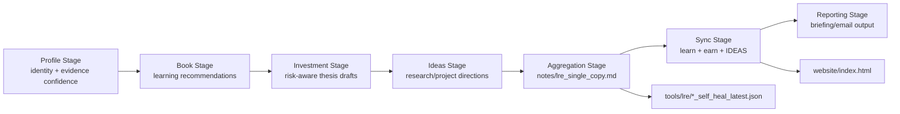
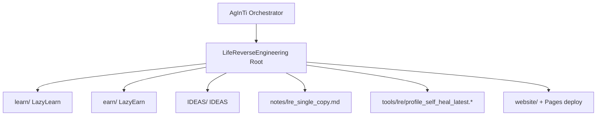

[English](../README.md) · [العربية](README.ar.md) · [Español](README.es.md) · [Français](README.fr.md) · [日本語](README.ja.md) · [한국어](README.ko.md) · [Tiếng Việt](README.vi.md) · [中文 (简体)](README.zh-Hans.md) · [中文（繁體）](README.zh-Hant.md) · [Deutsch](README.de.md) · [Русский](README.ru.md)


# LifeReverseEngineering

[](https://github.com/lachlanchen/LifeReverseEngineering)
[](https://lre.lazying.art/)
[](https://github.com/lachlanchen/LifeReverseEngineering/actions/workflows/static.yml)
[](#pipeline-logic)
[](#single-copy-output-policy)
[](#features)
[](#i18n)

LifeReverseEngineering（LRE）是一个个人深度研究工作区，可将个人画像上下文转化为三条执行轨道中的可执行产出：

- `learn`（LazyLearn）：书单计划与学习路径
- `earn`（LazyEarn）：投资想法与论点跟踪
- `IDEAS`：研究方向与项目概念

该仓库面向迭代式运行并采用单副本更新模式，因此每个周期都会刷新最新产物，而不是无休止地追加重复内容。

## 概览

LRE 充当协同与汇总层，而大部分领域实现位于 Git 子模块中：

- `learn/`：学习与计算物理/化学相关工作
- `earn/`：投资简报、PDF 产物与静态站点输出
- `IDEAS/`：从想法到发布的工作流与生成文档目录

在根仓库层，LRE 主要关注：

- 流水线框架定义与编排交接
- `notes/` 中的单副本报告产物
- `tools/` 中的自愈诊断
- 从 `website/` 部署到 `lre.lazying.art` 的根落地页

### 快速范围图

| 区域 | 主路径 | 职责 |
|---|---|---|
| 🧭 编排交接 | Root repo | 流水线框架 + 协同 |
| 📄 汇总报告 | `notes/lre_single_copy.md` | 单一最新版 markdown 简报 |
| 🩺 诊断 | `tools/lre/` | 自愈快照与日志 |
| 🌐 公开落地页 | `website/` | 根级 GitHub Pages 部署 |
| 🧠 领域执行 | `learn/`, `earn/`, `IDEAS/` | 各轨道实现 |

## 状态

LRE 当前处于活跃状态，并针对以下目标优化：

- 高频迭代更新
- 证据感知的研究摘要
- 跨仓库输出同步

### 当前运行态势

| 信号 | 状态 |
|---|---|
| Root pipeline posture | ✅ Active |
| Root Pages deployment | ✅ Enabled (`website/`) |
| Root i18n README variants | 🟡 Directory present, files pending |
| Output model | ✅ Single-copy overwrite/update |

## Features

- 三轨协同模型（`learn`、`earn`、`IDEAS`），职责边界清晰。
- 单副本输出策略，便于审计并降低运行噪音。
- 根级 GitHub Pages 仅从 `website/` 部署。
- 轨道级自愈日志快照，便于调试与提示词/工具演进。
- 基于子模块的架构，各轨道可独立演进。
- 已预留根级 `i18n/` 目录用于多语言 README 变体。

## 核心结构

```text
LifeReverseEngineering/
├── learn/            # LazyLearn submodule
├── earn/             # LazyEarn submodule
├── IDEAS/            # IDEAS submodule
├── notes/            # consolidated outputs (single-copy reports)
├── tools/            # self-heal logs and helper artifacts
└── website/          # static website for GitHub Pages
```

展开后的根目录结构：

```text
LifeReverseEngineering/
├── README.md
├── .gitmodules
├── .github/
│   ├── FUNDING.yml
│   └── workflows/static.yml
├── website/
│   ├── index.html
│   ├── CNAME
│   └── logos/
├── notes/
│   └── lre_single_copy.md
├── tools/
│   └── lre/
│       ├── profile_self_heal_latest.json
│       └── profile_self_heal_latest.log
├── i18n/                 # exists, currently empty
├── learn/                # submodule
├── earn/                 # submodule
└── IDEAS/                # submodule
```

## Pipeline Logic

LRE 以分阶段流水线运行（由上层 AgInTi 仓库中的提示词工具编排）：

1. Profile 阶段：解析身份锚点与证据置信度。
2. Book 阶段：生成以成长为导向的阅读建议。
3. Investment 阶段：起草机会、风险框架与论点笔记。
4. Ideas 阶段：提出研究/项目方向与后续动作。
5. Aggregation 阶段：构建单副本 markdown 报告。
6. Sync 阶段：将最新输出写入 `learn`、`earn` 与 `IDEAS`。
7. Reporting 阶段：生成最终邮件/简报内容。



### 运行时归属视图



## Single-Copy Output Policy

本仓库对关键摘要文件采用覆盖/更新行为：

- 主要笔记只保留一个当前版本。
- 旧的 “latest” 快照会被新一轮输出替换。
- 自愈诊断保留在专用工具/日志路径下。

这使得每日/周期性运行更整洁、可审计且易于检查。

### 关键产物与行为

| 产物 | 行为 |
|---|---|
| `notes/lre_single_copy.md` | 覆盖/更新为最新汇总报告 |
| `tools/lre/profile_self_heal_latest.json` | 替换为最新根级自愈快照 |
| `tools/lre/profile_self_heal_latest.log` | 更新为最新诊断日志 |

## 前置条件

- `git` 2.30+（推荐），并支持子模块。
- 可访问 `.gitmodules` 中列出的 GitHub 子模块。
- 如果使用当前 IDEAS 子模块 URL，需要为 `git@github.com:lachlanchen/IDEAS.git` 配置 SSH 密钥。
- 依据轨道工作可选安装以下工具：
  - Python 3.x + Jupyter 栈（`learn/` 工作流）
  - `pandoc` + `xelatex`（`earn/` PDF 工作流）
  - Node.js 18 与 `latexmk`/`xelatex`（`IDEAS/` 站点 + 发布工作流）

## 安装

使用子模块初始化方式克隆：

```bash
git clone --recurse-submodules https://github.com/lachlanchen/LifeReverseEngineering.git
cd LifeReverseEngineering
```

如果已克隆但未初始化子模块：

```bash
git submodule update --init --recursive
```

保持子模块与其跟踪引用同步：

```bash
git submodule sync --recursive
git submodule update --remote --recursive
```

## 使用

典型的根级使用方式以报告为中心，而非应用运行时为中心。

1. 查看最新汇总输出：

```bash
sed -n '1,120p' notes/lre_single_copy.md
```

2. 查看最新画像自愈诊断：

```bash
sed -n '1,160p' tools/lre/profile_self_heal_latest.json
sed -n '1,80p' tools/lre/profile_self_heal_latest.log
```

3. 在本地预览根站点：

```bash
python3 -m http.server 8000 --directory website
# then open http://localhost:8000
```

4. 将 `website/` 更新推送到 `main`，触发根级 Pages 部署（`.github/workflows/static.yml`）。

## 配置

### 子模块连线

定义于 `.gitmodules`：

- `learn` -> `https://github.com/lachlanchen/LazyLearn.git`
- `earn` -> `https://github.com/lachlanchen/LazyEarn.git`
- `IDEAS` -> `git@github.com:lachlanchen/IDEAS.git`

### 网站与域名

- 静态站点源：`website/index.html`
- 自定义域目标：`lre.lazying.art`（来自 `website/CNAME`）
- 根级部署工作流：`.github/workflows/static.yml`
- 部署产物范围：仅 `website/`

### i18n

- 根级 i18n 目录已存在：`i18n/`
- 当前状态：根级翻译文件尚未齐备
- 子模块（`learn`、`earn`、`IDEAS`）已在各自 `i18n/` 目录维护多语言 README 变体
- 根级语言选项策略：每个 README 变体顶部仅保留一行语言导航，并避免重复语言导航头

### 输出与诊断

- 汇总报告：`notes/lre_single_copy.md`
- 根级自愈快照：`tools/lre/profile_self_heal_latest.json`
- 相关的各轨道快照：
  - `learn/tools/lre/books_self_heal_latest.json`
  - `earn/tools/lre/investments_self_heal_latest.json`
  - `IDEAS/tools/lre/ideas_self_heal_latest.json`

## 示例

### 示例：验证运行新鲜度

```bash
ls -lt notes/lre_single_copy.md tools/lre/profile_self_heal_latest.json
```

### 示例：快速审查弱信号诊断

```bash
rg -n "weak|anchor|identity|non_empty" tools/lre/profile_self_heal_latest.json
```

### 示例：在修改 `IDEAS/ideas/*.md` 后更新 IDEA 文档

```bash
cd IDEAS
npm install --no-save marked
node scripts/generate_site.mjs
```

### 示例：重新生成并发布根站点

```bash
# edit website/index.html
git add website/index.html .github/workflows/static.yml
git commit -m "Update LRE website"
git push origin main
```

## 开发说明

- 该仓库是协同层，不是单一打包应用。
- 根目录目前不存在统一的 `package.json`、`pyproject.toml` 或统一锁文件。
- 根级 CI 以部署（Pages）为重点，而非测试/lint。
- 分阶段编排脚本被标注为位于上层 AgInTi 仓库，而不在本仓库中。
- 站点在根目录故意采用静态资源，且无构建步骤。

## 故障排查

| 症状 | 检查 / 修复 |
|---|---|
| 克隆后子模块为空 | 运行 `git submodule update --init --recursive`。 |
| IDEAS 子模块认证失败 | 确保对 `git@github.com:lachlanchen/IDEAS.git` 具备 GitHub SSH 密钥访问，或按需将子模块 URL 切换为 HTTPS。 |
| 根级 Pages 站点未更新 | 确认变更文件位于 `website/**` 或 `.github/workflows/static.yml` 下，且分支为 `main`。 |
| 站点本地可渲染但自定义域不可用 | 验证 `website/CNAME` 包含 `lre.lazying.art`，并确认 DNS 已正确指向 GitHub Pages。 |
| 自愈报告看起来过旧 | 检查 `tools/lre/` 中的文件修改时间，并在 `notes/lre_single_copy.md` 中跟踪运行 ID。 |
| 日志出现区域设置警告（如 `LC_ALL=C.UTF-8`） | 通常属于环境层面问题，对报告生成一般是非致命的。 |

## 路线图

- 在 `i18n/` 下补齐根级多语言 README 变体，并保持语言选项同步。
- 增加根级完整性检查（链接验证 + 产物新鲜度检查）。
- 基于自愈快照改进跨轨道证据质量仪表盘。
- 明确并自动化父级编排器从 AgInTi -> LRE 的交接契约。
- 扩展针对重复弱信号场景的故障排查手册。

## 相关仓库

- AgInTi：编排与提示词工具系统。
- LazyLearn（`learn/`）：学习与阅读输出。
- LazyEarn（`earn/`）：投资输出。
- IDEAS（`IDEAS/`）：研究/创意输出。

## 贡献

欢迎围绕以下方向贡献：

- 改进根级流水线文档
- 强化诊断与产物质量检查
- 提升网站清晰度与运行透明性
- 以一致格式补充根级 i18n README 变体

推荐流程：

1. 新建 issue，描述范围与受影响轨道。
2. 变更范围保持在正确层级（`root` vs `learn`/`earn`/`IDEAS`）。
3. 对任何工作流或命令变更附上变更前后说明。
4. 如果涉及部署行为，请给出精确路径与触发影响。

## 支持

资助与支持链接（来自 `.github/FUNDING.yml`）：

- GitHub Sponsors: [https://github.com/sponsors/lachlanchen](https://github.com/sponsors/lachlanchen)
- Project network: [https://lazying.art](https://lazying.art)
- Community/chat: [https://chat.lazying.art](https://chat.lazying.art)
- Related initiative: [https://onlyideas.art](https://onlyideas.art)

## 许可证

截至 2026 年 3 月 3 日，该仓库根目录仍未包含 `LICENSE` 文件。

假设：在添加许可证之前，除 GitHub 可见性带来的标准预期外，使用权尚未被明确授予。建议添加 `LICENSE` 文件以明确复用条款。
