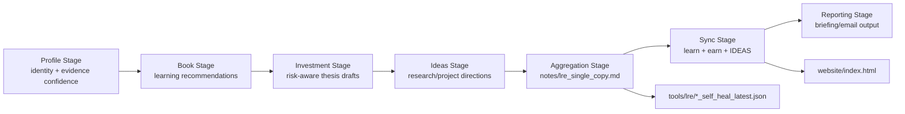
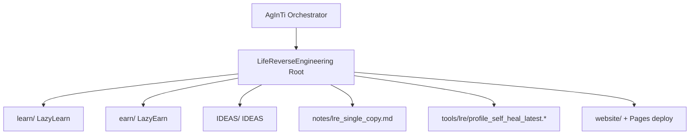

[English](../README.md) · [العربية](README.ar.md) · [Español](README.es.md) · [Français](README.fr.md) · [日本語](README.ja.md) · [한국어](README.ko.md) · [Tiếng Việt](README.vi.md) · [中文 (简体)](README.zh-Hans.md) · [中文（繁體）](README.zh-Hant.md) · [Deutsch](README.de.md) · [Русский](README.ru.md)


# LifeReverseEngineering

[](https://github.com/lachlanchen/LifeReverseEngineering)
[](https://lre.lazying.art/)
[](https://github.com/lachlanchen/LifeReverseEngineering/actions/workflows/static.yml)
[](#pipeline-logic)
[](#single-copy-output-policy)
[](#features)
[](#i18n)

LifeReverseEngineering（LRE）是一個個人深度研究工作區，將個人檔案脈絡轉化為三條執行軌道上的可行動輸出：

- `learn`（LazyLearn）：書單規劃與學習路徑
- `earn`（LazyEarn）：投資想法與論點追蹤
- `IDEAS`：研究方向與專案概念

此儲存庫為迭代式執行而設計，採用單副本更新模式；每次循環會刷新最新產物，而非無限追加重複內容。

## 概覽

LRE 作為協調與彙整層，而多數領域實作位於 Git 子模組：

- `learn/`：學習與計算物理／化學工作
- `earn/`：投資簡報、PDF 產物與靜態網站輸出
- `IDEAS/`：從想法到發佈的工作流程與生成文件目錄

在根層級，LRE 主要聚焦於：

- 管線框架與協調交接
- `notes/` 中的單副本報告產物
- `tools/` 中的自我修復診斷
- 從 `website/` 部署到 `lre.lazying.art` 的根落地頁

### 快速範圍地圖

| 區域 | 主要路徑 | 職責 |
|---|---|---|
| 🧭 協調交接 | Root repo | 管線框架 + 協調 |
| 📄 整合報告 | `notes/lre_single_copy.md` | 單一最新版 markdown 簡報 |
| 🩺 診斷 | `tools/lre/` | 自我修復快照與日誌 |
| 🌐 公開落地頁 | `website/` | 根層 GitHub Pages 部署 |
| 🧠 領域執行 | `learn/`, `earn/`, `IDEAS/` | 各軌道實作 |

## 狀態

LRE 目前處於活躍狀態，並針對以下方向最佳化：

- 高頻率迭代更新
- 具證據感知的研究摘要
- 跨儲存庫輸出同步

### 目前運作態勢

| 訊號 | 狀態 |
|---|---|
| Root pipeline posture | ✅ Active |
| Root Pages deployment | ✅ Enabled (`website/`) |
| Root i18n README variants | 🟡 Directory present, files pending |
| Output model | ✅ Single-copy overwrite/update |

<a id="features"></a>

## 功能特色

- 三軌協調模型（`learn`、`earn`、`IDEAS`），責任邊界清楚。
- 單副本輸出策略，讓稽核更乾淨並降低運作噪音。
- 根層級 GitHub Pages 僅從 `website/` 部署。
- 軌道層級的自我修復日誌快照，可用於除錯與提示詞／工具演進。
- 以子模組為核心的架構，讓各軌道可獨立演進。
- 既有根層級 `i18n/` 目錄保留給多語 README 變體。

## 核心結構

```text
LifeReverseEngineering/
├── learn/            # LazyLearn submodule
├── earn/             # LazyEarn submodule
├── IDEAS/            # IDEAS submodule
├── notes/            # consolidated outputs (single-copy reports)
├── tools/            # self-heal logs and helper artifacts
└── website/          # static website for GitHub Pages
```

展開後的根層地圖：

```text
LifeReverseEngineering/
├── README.md
├── .gitmodules
├── .github/
│   ├── FUNDING.yml
│   └── workflows/static.yml
├── website/
│   ├── index.html
│   ├── CNAME
│   └── logos/
├── notes/
│   └── lre_single_copy.md
├── tools/
│   └── lre/
│       ├── profile_self_heal_latest.json
│       └── profile_self_heal_latest.log
├── i18n/                 # exists, currently empty
├── learn/                # submodule
├── earn/                 # submodule
└── IDEAS/                # submodule
```

<a id="pipeline-logic"></a>

## 管線邏輯

LRE 以分階段管線運行（由父層 AgInTi 儲存庫中的提示工具編排）：

1. Profile 階段：解析身分錨點與證據信心度。
2. Book 階段：生成以成長為目標的閱讀建議。
3. Investment 階段：起草機會、風險框架與投資論點筆記。
4. Ideas 階段：提出研究／專案方向與下一步行動。
5. Aggregation 階段：建立單副本 markdown 報告。
6. Sync 階段：將最新輸出寫入 `learn`、`earn`、`IDEAS`。
7. Reporting 階段：產出最終 email／簡報內容。



### Runtime Ownership View



<a id="single-copy-output-policy"></a>

## 單副本輸出策略

此儲存庫對關鍵摘要檔案採用覆寫／更新行為：

- 保留主要筆記的一份當前版本。
- 以新執行輸出取代舊的「latest」快照。
- 將自我修復診斷保留在專用工具／日誌路徑。

這讓每日／定期執行保持乾淨、可稽核且易於檢查。

### 關鍵產物與行為

| 產物 | 行為 |
|---|---|
| `notes/lre_single_copy.md` | 以最新整合報告覆寫／更新 |
| `tools/lre/profile_self_heal_latest.json` | 以最新根層自我修復快照取代 |
| `tools/lre/profile_self_heal_latest.log` | 更新為最新診斷日誌 |

## 先決條件

- 建議使用含子模組支援的 `git` 2.30+。
- 需可存取 `.gitmodules` 列出的 GitHub 子模組。
- 若沿用目前 IDEAS 子模組 URL，需設定 `git@github.com:lachlanchen/IDEAS.git` 的 SSH 金鑰。
- 依軌道工作而定的可選工具：
  - Python 3.x + Jupyter 堆疊（`learn/` 工作流程）
  - `pandoc` + `xelatex`（`earn/` PDF 工作流程）
  - Node.js 18 與 `latexmk`/`xelatex`（`IDEAS/` 網站 + 發佈工作流程）

## 安裝

以已初始化子模組方式克隆：

```bash
git clone --recurse-submodules https://github.com/lachlanchen/LifeReverseEngineering.git
cd LifeReverseEngineering
```

若先前未帶子模組克隆：

```bash
git submodule update --init --recursive
```

讓子模組與其追蹤引用保持同步：

```bash
git submodule sync --recursive
git submodule update --remote --recursive
```

## 使用方式

典型的根層使用方式以報告為中心，而非應用執行時為中心。

1. 檢查最新整合輸出：

```bash
sed -n '1,120p' notes/lre_single_copy.md
```

2. 檢查最新 profile 自我修復診斷：

```bash
sed -n '1,160p' tools/lre/profile_self_heal_latest.json
sed -n '1,80p' tools/lre/profile_self_heal_latest.log
```

3. 在本機預覽根網站：

```bash
python3 -m http.server 8000 --directory website
# then open http://localhost:8000
```

4. 將 `website/` 更新推送到 `main`，觸發根層 Pages 部署（`.github/workflows/static.yml`）。

## 設定

### 子模組接線

定義於 `.gitmodules`：

- `learn` -> `https://github.com/lachlanchen/LazyLearn.git`
- `earn` -> `https://github.com/lachlanchen/LazyEarn.git`
- `IDEAS` -> `git@github.com:lachlanchen/IDEAS.git`

### 網站與網域

- 靜態網站來源：`website/index.html`
- 自訂網域目標：`lre.lazying.art`（來自 `website/CNAME`）
- 根層部署工作流程：`.github/workflows/static.yml`
- 部署產物範圍：僅 `website/`

<a id="i18n"></a>

### i18n

- 根層 i18n 目錄已存在：`i18n/`
- 目前狀態：尚無根層翻譯檔
- 子模組（`learn`、`earn`、`IDEAS`）已在各自 `i18n/` 目錄維護多語 README 變體
- 根層語言選項策略：在每個 README 變體僅維持單一頂部語言列，並避免重複語言選項標頭

### 輸出與診斷

- 整合報告：`notes/lre_single_copy.md`
- 根層自我修復快照：`tools/lre/profile_self_heal_latest.json`
- 相關每軌快照：
  - `learn/tools/lre/books_self_heal_latest.json`
  - `earn/tools/lre/investments_self_heal_latest.json`
  - `IDEAS/tools/lre/ideas_self_heal_latest.json`

## 範例

### 範例：驗證執行新鮮度

```bash
ls -lt notes/lre_single_copy.md tools/lre/profile_self_heal_latest.json
```

### 範例：快速稽核弱訊號診斷

```bash
rg -n "weak|anchor|identity|non_empty" tools/lre/profile_self_heal_latest.json
```

### 範例：在變更 `IDEAS/ideas/*.md` 後更新 IDEA 文件

```bash
cd IDEAS
npm install --no-save marked
node scripts/generate_site.mjs
```

### 範例：重新產生並發佈根網站

```bash
# edit website/index.html
git add website/index.html .github/workflows/static.yml
git commit -m "Update LRE website"
git push origin main
```

## 開發備註

- 此儲存庫是協調層，不是單一封裝應用程式。
- 根層目前沒有 `package.json`、`pyproject.toml` 或統一 lockfile。
- 根層 CI 以部署（Pages）為主，而非測試／lint 為主。
- 分階段編排腳本被描述為位於父層 AgInTi 儲存庫，而非本儲存庫。
- 網站在根層刻意採用靜態資產且不含建置步驟。

## 疑難排解

| 症狀 | 檢查／修復 |
|---|---|
| 克隆後子模組是空的 | 執行 `git submodule update --init --recursive`。 |
| IDEAS 子模組驗證失敗 | 確認 `git@github.com:lachlanchen/IDEAS.git` 的 GitHub SSH 金鑰存取，或在需要時改用 HTTPS 子模組 URL。 |
| Root Pages 網站未更新 | 確認變更檔案位於 `website/**` 或 `.github/workflows/static.yml`，且分支為 `main`。 |
| 網站本機可渲染但自訂網域不可 | 確認 `website/CNAME` 包含 `lre.lazying.art`，且 DNS 已正確指向 GitHub Pages。 |
| 自我修復報告看起來過舊 | 檢查 `tools/lre/` 的檔案修改時間，以及 `notes/lre_single_copy.md` 中的執行 ID。 |
| 日誌出現語系警告（例如 `LC_ALL=C.UTF-8`） | 這通常是環境層級問題，對報告生成通常不致命。 |

## 路線圖

- 在 `i18n/` 新增根層多語 README 變體，並保持語言選項同步。
- 新增根層完整性檢查（連結驗證 + 產物新鮮度檢查）。
- 基於自我修復快照改善跨軌證據品質儀表板。
- 釐清並自動化 AgInTi -> LRE 的父層編排交接契約。
- 擴充針對重複弱訊號情境的疑難排解手冊。

## 相關儲存庫

- AgInTi：編排與提示工具系統。
- LazyLearn（`learn/`）：學習與閱讀輸出。
- LazyEarn（`earn/`）：投資輸出。
- IDEAS（`IDEAS/`）：研究／想法輸出。

## 貢獻

歡迎針對以下方向貢獻：

- 改善根層管線文件
- 強化診斷與產物品質檢查
- 提升網站清晰度與運作透明度
- 以一致格式新增根層 i18n README 變體

建議流程：

1. 開 issue 說明範圍與受影響軌道。
2. 將變更限定在正確層級（`root` 與 `learn`/`earn`/`IDEAS`）。
3. 任何工作流程或命令變更都附上 before/after 說明。
4. 若涉及部署行為，請附上精確路徑與觸發影響。

## 支援

資助與支援連結（來自 `.github/FUNDING.yml`）：

- GitHub Sponsors: [https://github.com/sponsors/lachlanchen](https://github.com/sponsors/lachlanchen)
- Project network: [https://lazying.art](https://lazying.art)
- Community/chat: [https://chat.lazying.art](https://chat.lazying.art)
- Related initiative: [https://onlyideas.art](https://onlyideas.art)

## 授權

截至 2026 年 3 月 3 日，本儲存庫根層尚未提供 `LICENSE` 檔案。

假設：在新增授權之前，除 GitHub 可見性的一般預期外，使用權並未被明確授予。請新增 `LICENSE` 檔案以明確化重用條款。
